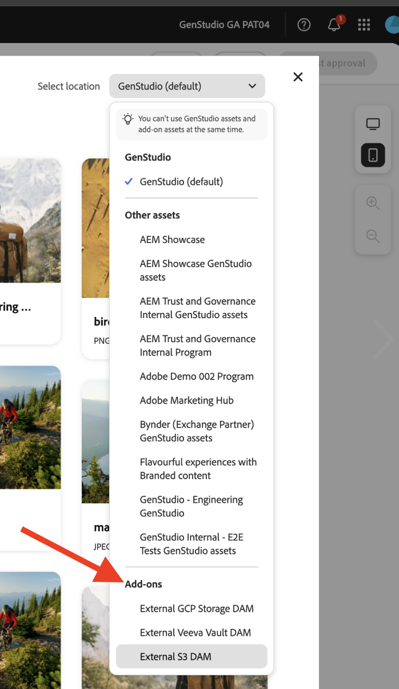

# 앱 배포

앱을 실행하면 추가 기능을 배포하기 전 동작에 대한 사전 스냅숏이 제공됩니다. 이렇게 하면 디버깅에 도움이 될 수 있습니다.

## 앱 실행

`https://localhost:9080`에서 앱 실행:

```bash
aio app run
```

## 앱 배포

1. 배포 작업 영역으로 이동합니다.

   ```bash
   aio app use -w [deployment_workspace]
   ```

2. 앱 배포:

   ```bash
   aio app deploy
   ```

## 강제 재배포

승인을 위해 다시 제출하지 않고 앱을 강제로 빌드 및 배포할 수 있습니다.

>[!NOTE]
>
>빌드 및 배포를 강제로 적용하면 기존 배포가 덮어쓰기됩니다. 먼저 테스트 환경에서 **앱을 철저히 테스트하세요**.

```bash
aio app build --force-build
```

```bash
aio app deploy --force-deploy
```

## 동시에 구축 및 배포

```bash
aio app deploy --force-build --force-deploy
```

## 새 앱 찾기

배포 후 GenStudio for Performance Marketing에서 새 앱을 볼 수 있습니다.

### URL로 보기

GenStudio for Performance Marketing URL에 `query` 매개 변수를 추가하여 새 앱을 확인하세요.

```txt
https://experience.adobe.com/?ext=https://<my-deployed-add-on>.adobeio-static.net/index.html#/@<ims-org>/genstudio/create
```

### UI에서 보기

배포한 확장 유형에 따라 UI의 다른 위치에서 새 확장을 찾을 수 있습니다. 현재 사용 가능한 확장 지점은 다음과 같습니다.

* 다음을 포함하는 규정 준수 확장:
   * [*프롬프트 확장 지점*](#find-prompt-extensions) - 고객이 LLM 생성에 추가 컨텍스트를 추가할 수 있습니다.
   * [*유효성 검사 확장 지점*](#find-validation-extensions)&#x200B;을 통해 고객이 LLM에서 생성된 콘텐츠의 유효성을 검사할 수 있습니다. 유효성 검사는 종종 프롬프트 확장과 쌍을 이루어 확장된 프롬프트로 생성된 콘텐츠가 고객 요구 사항(예: 의료용 약물 클레임 또는 합법적)에 대해 컴플레인인지 확인합니다
* [DAM(디지털 자산 관리) 확장](#find-dam-extensions)
* [템플릿 확장](#find-template-extensions)
* [번역 확장](#find-translation-extensions)

### 프롬프트 확장 찾기

프롬프트 확장은 템플릿의 **매개 변수 섹션**&#x200B;에 있는 **추가 기능** 드롭다운에서 찾을 수 있습니다.

{width="600" zoomable="yes"}

추가 기능 대화 상자가 열리고 LLM 생성을 위해 추가할 추가 컨텍스트를 선택할 수 있습니다.

{width="600" zoomable="yes"}

### 유효성 검사 확장 찾기

유효성 검사 확장은 프롬프트 생성 후 결과와 함께 표시되는 오른쪽 사이드바에서 찾을 수 있습니다.

{width="600" zoomable="yes"}

선택한 확장을 실행하여 생성된 컨텐츠의 유효성을 검사합니다.

{width="600" zoomable="yes"}

### DAM 확장 찾기

템플릿의 **매개 변수 섹션**&#x200B;에서 콘텐츠를 선택할 때 DAM(Digital Asset Management) 확장이 발견되었습니다. 추가 기능을 보려면 **위치 선택** 드롭다운 아래쪽을 보십시오.

{width="600" zoomable="yes"}

### 템플릿 확장 찾기

템플릿을 선택할 때 **외부 템플릿 앱** 탭에서 템플릿 확장을 찾았습니다. 이 탭은 선택할 템플릿 앱이 있을 때만 나타납니다.

{width="600" zoomable="yes"}


### 번역 확장 찾기

GenStudio 기본 번역을 사용하는 대신 번역 확장 포인트를 사용하여 프록시를 통해 나만의 번역 서비스를 가져올 수 있습니다.
이러한 확장에 대한 UI 위치가 없습니다.

확장을 등록하면 제공된 번역 서비스가 사용됩니다. 그렇지 않으면 기본 GenStudio 번역 서비스가 사용됩니다.


추가 기능에 만족하면 `query` 매개 변수 없이 배포할 준비가 된 것입니다.

이제 [앱을 배포](distribute-app.md)할 수 있습니다.
