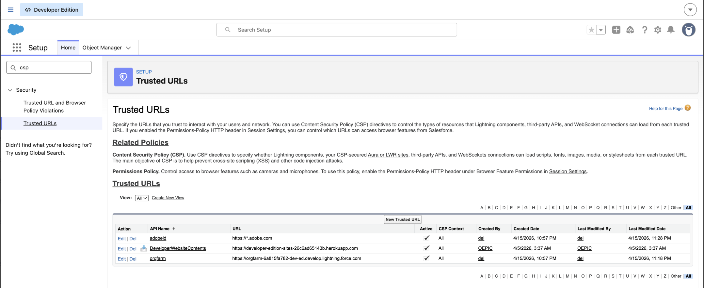

# Salesforce의 Experience Selector MFE

이 항목에서는 고객 및 구현자가 Salesforce 조직에서 [!DNL GenStudio for Performance Marketing] Experience Selector MFE(마이크로 프론트엔드)를 배포하고 실행하는 방법을 설명합니다. 관리자 단계(코드 없음), 개발자 단계(배포 및 구성) 및 CSP(콘텐츠 보안 정책)와 같은 보안 관련 설정을 다룹니다.

일반 MFE 통합 옵션, 구성 속성 및 프레임워크 예제에 대해서는 [GenStudio Experience Selector MFE](experience-selector.md)를 참조하십시오.

## 이 통합의 기능

>[!VIDEO](https://video.tv.adobe.com/v/3491086?captions=kor&learn=on)

LWC(Lightning Web Component) `sfgsmfe`은(는) Adobe의 경험 선택기 UMD 번들을 로드하여 `<dialog>`에서 렌더링하므로 사용자는 [!DNL GenStudio for Performance Marketing]에서 경험을 선택할 수 있습니다.

통합은 다음과 같은 작업도 수행할 수 있습니다.

* **미리 보기 및 디코딩:** 선택한 페이로드를 JSON으로 표시하고, HTML을 디코딩하고, LWC 내에서 정리된 HTML 미리 보기를 표시합니다.
* **전자 메일 템플릿(선택 사항):** Salesforce의 **[!UICONTROL 전자 메일 템플릿 만들기]** 흐름에서 Apex(`EmailTemplateController.createEmailTemplate`)를 호출하여 `EmailTemplate` 레코드(HTML, 제목 및 폴더)를 삽입할 수 있습니다.

[!DNL GenStudio for Performance Marketing]에 대한 Experience Selector 스크립트는 일반적인 구현의 Salesforce 정적 리소스가 아닌 `experience.adobe.com`에 Adobe의 호스팅된 URL에서 로드됩니다.

## 사전 요구 사항

* **Salesforce 조직:** 메타데이터를 배포하고 **[!UICONTROL Lightning App Builder]**&#x200B;을 사용할 수 있는 샌드박스 또는 프로덕션 조직입니다.
* **Salesforce CLI:** Salesforce CLI(`sf`)가 설치되고 인증되었습니다. 예:

  ```bash
  sf org login web --alias <your-org-alias>
  ```

* **권한:** 전자 메일 템플릿을 만드는 사용자는 대상 전자 메일 템플릿 폴더에 액세스해야 하며 조직 정책에 따라 템플릿을 만들 수 있는 권한이 필요합니다. Apex는 `with sharing`을(를) 실행합니다.
* **Adobe/GenStudio:** Adobe IMS 조직 ID와 SUSI `clientId`이(가) Adobe 구성과 일치해야 합니다([통합 값 구성](#configure-integration-values-developer--implementation) 참조).
* **브라우저/CSP:** Salesforce에서 `https://experience.adobe.com`의 스크립트 로드를 허용해야 합니다([콘텐츠 보안 정책 및 Adobe URL 구성](#configure-content-security-policy-and-adobe-url) 참조).

## 패키지 배포(개발자)

프로젝트에서 Salesforce DX 레이아웃을 사용합니다. 기본 패키지 디렉터리는 `force-app`입니다.

1. 프로젝트 루트에서 타겟 조직에 소스를 배포합니다.

   ```bash
   sf project deploy start --source-dir force-app --target-org <your-org-alias>
   ```

2. 오류 없이 배포가 완료되는지 확인합니다.

* `force-app/main/default/lwc/sfgsmfe` — LWC 번들(HTML, JS, CSS, meta).
* `force-app/main/default/classes/EmailTemplateController.cls` — 템플릿 생성을 위한 Apex.

리포지토리에 정적 리소스(`reactApp`, `sfgsmfe_react`)가 있을 수도 있습니다. `sfgsmfe.js`의 현재 [!DNL GenStudio for Performance Marketing] 로더가 `standalone.js`에 대해 Adobe CDN URL을 사용합니다. 구현을 변경하지 않는 한 해당 로드 경로에 이러한 정적 리소스가 필요하지 않습니다.

## 번개 페이지에 구성 요소 추가(관리자)

`sfgsmfe` 구성 요소가 다음에 대해 노출되었습니다.

* 라이트닝 앱 페이지
* 홈 페이지
* 페이지 기록
* 탭(사용자 정의 탭의 번개 페이지 사용)

구성 요소를 추가하려면:

1. **[!UICONTROL 설치]**&#x200B;에서 **[!UICONTROL 앱 관리자]**&#x200B;를 엽니다.
1. **[!UICONTROL 새 Lightning 앱]**&#x200B;을 만들거나 확장하려는 기존 앱을 엽니다.
   {width="80%" zoomable="yes"}
1. 앱을 열고 **[!UICONTROL 편집]**&#x200B;을 선택합니다.
   {width="80%" zoomable="yes"}
1. **[!UICONTROL 새 페이지]**&#x200B;를 만들거나 기존 Lightning 페이지를 편집하세요.
   {width="60%" zoomable="yes"}
1. **[!UICONTROL Lightning App Builder]**&#x200B;에서 **sfgsmfe** 구성 요소를 레이아웃으로 끕니다.
1. **[!UICONTROL 저장]**, **[!UICONTROL 활성화]**&#x200B;하고, 원하는 사용자가 열 수 있도록 페이지를 올바른 Lightning 앱, 프로필 및 앱 가시성에 할당합니다.

## 컨텐츠 보안 정책 및 Adobe URL 구성

LWC는 Adobe의 UMD 번들에 `src` 지점이 있는 `<script>` 태그를 삽입합니다. 예:

`https://experience.adobe.com/solutions/GenStudio-experience-selector-mfe/static-assets/resources/@genstudio/experience-selector/umd/standalone.js`

조직의 CSP 및 Lightning 보안 설정에 따라 이 원본을 스크립트 로드에 사용할 수 있도록 Salesforce을 구성해야 합니다.

스크립트 로드에 실패한 경우:

1. 브라우저 개발자 도구를 엽니다.
1. 차단된 요청 또는 CSP 위반에 대해서는 **[!UICONTROL Console]** 및 **[!UICONTROL Network]** 탭을 확인하십시오.
1. Lightning에 대한 현재 Salesforce 설명서에 따라 `https://experience.adobe.com`에 대한 **[!UICONTROL 신뢰할 수 있는 URL]**(및 Salesforce 릴리스에 대한 모든 관련 설정)을 추가하거나 조정하십시오.
   {width="80%" zoomable="yes"}

## 통합 값 구성(개발자/구현)

`sfgsmfe`에 대한 LWC JavaScript에 여러 값이 설정되어 있습니다. 고객은 일반적으로 환경별로 이러한 기능을 교체합니다.

| 값 | 설명 |
| --- | --- |
| `folderId` | 새 템플릿을 만드는 전자 메일 템플릿의 Salesforce 폴더 ID(`00l...`)입니다. Apex에 필요합니다. 폴더가 존재하고 실행 중인 사용자가 액세스할 수 있어야 합니다. |
| `imsOrg` | `GenStudioExperienceSelector.renderExperienceSelectorWithSUSI`에 전달된 Adobe IMS 조직 식별자입니다. |
| `susiConfig.clientId` | Experience Selector 앱 등록에 대한 Adobe SUSI 클라이언트 ID. |
| GenStudio `script.src` | UMD `standalone.js` 번들의 URL입니다. Adobe에서 새 경로를 게시하는 경우 업데이트하십시오. |

전자 메일 템플릿을 만들면 GenStudio 필드가 템플릿에 매핑됩니다(예: `experienceFields`의 제목). 콘텐츠 모델이 다른 경우 LWC에서 매핑을 조정합니다.

`renderExperienceSelectorWithSUSI` 및 관련 옵션에 대한 자세한 내용은 경험 선택기 MFE 항목의 [구성 속성](experience-selector.md#configuration-properties)을 참조하십시오.

## Apex: EmailTemplateController

`EmailTemplateController.createEmailTemplate`은(는) 일반적으로

* 템플릿 이름, 폴더 ID 및 비어 있지 않은 HTML의 유효성을 검사합니다.
* `TemplateType = 'custom'`, `HtmlValue`, `Subject`, `Body` 및 폴더 할당으로 `EmailTemplate`을(를) 만듭니다.
* `AuraHandledException`을(를) 통해 LWC에 오류를 표시합니다.

운영 팁:

* 조직의 DeveloperName 고유성 및 이름 지정 규칙을 준수합니다.
* 폴더 ID를 확인하고 사용자가 해당 폴더에 `EmailTemplate`개의 레코드를 만들 수 있는지 확인하십시오.
* DML이 정확한 오류를 캡처하지 못할 때 Salesforce 디버그 로그를 사용합니다.

## 유효성 검사 목록

통합에 대한 확실한 유효성 검사를 위해 배포 및 구성 후 이 목록에서 항목을 확인합니다.

1. 배포가 오류 없이 완료됨.
1. 사용자는 `sfgsmfe`이(가) 포함된 번개 페이지를 열고 경험 선택기 UI를 볼 수 있습니다.
1. 구성 요소에 로드 오류가 표시되지 않습니다. 네트워크 탭에서 `standalone.js`에 대한 HTTP 200을 반환합니다.
1. **[!UICONTROL GenStudio 환경을 선택하십시오]** 선택기를 열고 선택 콜백이 실행됩니다.
1. 해당 흐름을 사용하면 **[!UICONTROL 전자 메일 템플릿 만들기]**&#x200B;에 성공하고 **[!UICONTROL 설치]**&#x200B;의 구성된 폴더에 템플릿이 나타납니다.

## 참조 -

* [GenStudio 경험 선택기 MFE](experience-selector.md)
