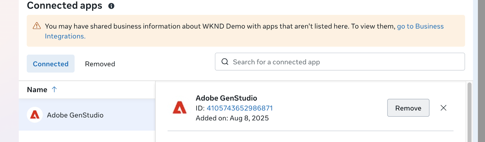

# Meta 광고에 연결

이 페이지에서는 Meta Ads 프로필 계정을 GenStudio for Performance Marketing에 연결 및 관리하여 캠페인을 관리하고, 콘텐츠를 내보내고, 활성 캠페인에 대한 광고 데이터에 액세스하는 방법을 설명합니다.

>[!BEGINSHADEBOX]

**필수 구성 요소**:

- 모든 Meta 서비스에 액세스할 수 있는 Facebook/Meta 로그인
- 다음을 포함한 Meta Business Portfolio 및 광고 계정에 대한 _모든 권한_:
   - 캠페인 관리
   - 성능 보기
   - Creative Hub mockup 관리
   - 고급 분석
- 브라우저에서 팝업 차단기 비활성화
- 연결을 시도하기 전에 Meta Business Manager에서 Instagram 계정 페이지 연결을 확인하십시오
- 연결 중인 모든 자산에 대한 관리자 액세스 확인

>[!ENDSHADEBOX]

## Meta 광고 계정 연결

1. **[!UICONTROL 자세히]** > **[!UICONTROL 설정]**&#x200B;을 클릭합니다.

1. _Data Connectors_ 섹션의 **[!UICONTROL Meta 광고]** 카드에서 _연결_&#x200B;을 클릭합니다.

1. Facebook 계정에 로그인합니다.

   팝업 차단기를 제거한 다음 **[!UICONTROL 새로 고침]**&#x200B;을 사용하여 다시 시도할 수 있습니다.

1. Facebook 인증 지침을 따라 계정 정보를 확인하고 **[!UICONTROL 다음 계정으로 계속...]**&#x200B;을 클릭합니다.

1. _[!UICONTROL 비즈니스용 Facebook 로그인]_(Meta - Adobe 기호)에서 다음 선택 사항을 단계별로 진행하여 GenStudio for Performance Marketing 액세스 권한을 부여합니다.

   - 하나 이상의 Meta 비즈니스 프로필을 선택하고 **[!UICONTROL 계속]**&#x200B;을 클릭합니다.
   - 하나 이상의 Meta 페이지를 선택하고 **[!UICONTROL 계속]**&#x200B;을 클릭합니다.
   - Instagram 계정을 하나 이상 선택하고 **[!UICONTROL 계속]**&#x200B;을 클릭합니다.
   - 선택 항목을 검토하고 **[!UICONTROL 저장]**&#x200B;을 클릭합니다.

     {width="400" zoomable="yes"}

1. 계정이 연결되어 있는지 확인받으면 **[!UICONTROL 가져오기]**&#x200B;를 클릭합니다.

   이 단계에서는 GenStudio for Performance Marketing이 최적의 성능을 위해 모든 광고, 메타데이터 및 지표에 액세스할 수 있도록 합니다.

1. _[!UICONTROL Meta 광고]_&#x200B;에서 [!DNL Insights]에 포함할 계정을 하나 이상 선택하고 **[!UICONTROL 선택]**&#x200B;을 클릭합니다.

1. _연결된 플랫폼_ 확인을 받으면 **[!UICONTROL 계정 보기]**&#x200B;를 클릭합니다.

   _[!UICONTROL Meta 광고 계정]_ 보기에는 `Account name`, `Added by`, `Date added` 및 `Status`이(가) 나열됩니다.

   {zoomable="yes"}

**[!UICONTROL 계정 추가]**&#x200B;를 사용하여 목록에 계정을 더 추가하십시오. 동일한 Meta 비즈니스 프로필에 연결된 계정을 추가할 때 인증 흐름이 약간 달라질 수 있습니다. 연결 프로세스 중에 새 Meta 광고 계정만 선택합니다.

## 연결 우수 사례

오류를 방지하려면 연결을 설정할 때 다음 모범 사례를 고려하십시오.

- [ ] 초기 연결에 대해 최소 자산 선택으로 시작합니다(단일 페이지만).
- [ ] 페이지 액세스가 작동하는지 확인한 후에만 Instagram 계정 추가
- [ ] Instagram 계정이 Meta Business Manager에서 선택한 Facebook 페이지와 제대로 연결되어 있는지 확인합니다.
- [ ] 단계별 접근 방법 사용: 먼저 기본 연결을 설정한 다음 자산을 확장합니다.
- [ ] 연결을 시도하기 전에 모든 자산에 대한 관리자 권한을 확인하십시오.

## Meta 광고 통합 연결 해제 및 문제 해결

경우에 따라 GenStudio for Performance Marketing 인스턴스가 Meta 광고 계정에 잘못 연결되어 있습니다. 문제를 일으킬 수 있는 일반적인 설정은 다음과 같습니다.

- 연결된 Facebook 페이지를 선택하지 않고 Instagram 계정이 선택됩니다.
- 초기 연결을 수행한 사용자에 대한 권한이 해지됨

이러한 상황에서는 Meta 광고 계정을 GenStudio for Performance Marketing 인스턴스에 다시 연결하는 것이 가장 좋습니다. 먼저 사용자가 Meta Business Manager에서 직접 앱 통합을 제거하여 권한 재설정을 위한 깨끗한 슬레이트를 만들어야 합니다. 이를 위해서는 Meta 비즈니스 관리자에 대한 관리자 액세스 권한이 필요합니다.

다음 단계에서는 캐시된 권한을 지우고 통합 흐름을 재설정합니다.

1. Facebook 웹 사이트를 방문하여 [Meta 비즈니스 관리자](https://business.facebook.com)에 액세스하세요.
1. 계정으로 로그인합니다. 계정에는 비즈니스 관리자에 대한 관리자 액세스 권한이 있어야 합니다.
1. Business Portfolio 설정으로 이동하려면 왼쪽 하단의 **[!UICONTROL 설정]** 톱니바퀴 아이콘을 클릭합니다.
1. 왼쪽 메뉴에서 **[!UICONTROL 통합]**&#x200B;을 클릭합니다.
1. **[!UICONTROL 연결된 앱]**을 선택하세요. 연결된 앱 목록에 Adobe GenStudio이 표시됩니다.
   
1. 앱 이름을 클릭합니다.
1. **[!UICONTROL 제거]**&#x200B;를 클릭합니다.
1. 메시지가 표시되면 제거를 확인합니다.

이제 Meta 광고 계정, Instagram 프로필 및 Facebook 페이지를 다시 연결할 수 있습니다.

## Instagram 계정 연결 문제

연결 설정 중에 연결된 Facebook 페이지를 연결하지 않고 Instagram 계정을 선택하면 문제가 발생할 수 있습니다. 이로 인해 다음과 같은 오류가 발생할 수 있습니다.

- &quot;{Page_Name}&quot;에 연결할 수 없거나 일반 연결 오류가 발생했습니다.
- 비즈니스 흐름을 위한 Facebook 로그인 중 연결 시간 초과.
- 여러 자산을 선택할 때 자동 오류가 발생합니다.
- Instagram, 페이지 및 광고 계정을 동시에 선택할 때 연결이 실패합니다.

### 해결 단계:

1. [Meta Business Manager](https://business.facebook.com) > 통합 > 연결된 앱으로 이동합니다.
1. 기존 &quot;Adobe GenStudio&quot; 통합이 있는 경우 제거합니다. **제거**&#x200B;를 클릭합니다.
1. GenStudio으로 돌아가서 연결 프로세스를 다시 시도하십시오.
1. 초기 연결 중에 대상 Facebook 페이지만 선택합니다.
1. 첫 번째 연결 시도 중에는 Instagram 계정을 선택하지 마십시오.
1. 다른 자산을 추가하기 전에 연결이 성공했는지 확인하십시오.
1. 페이지 연결이 안정적이면 Instagram 계정을 별도로 추가합니다.

