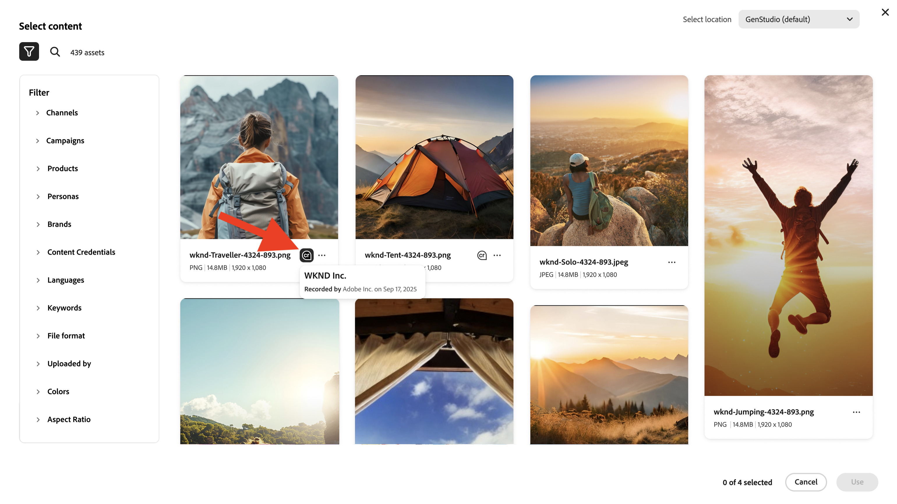
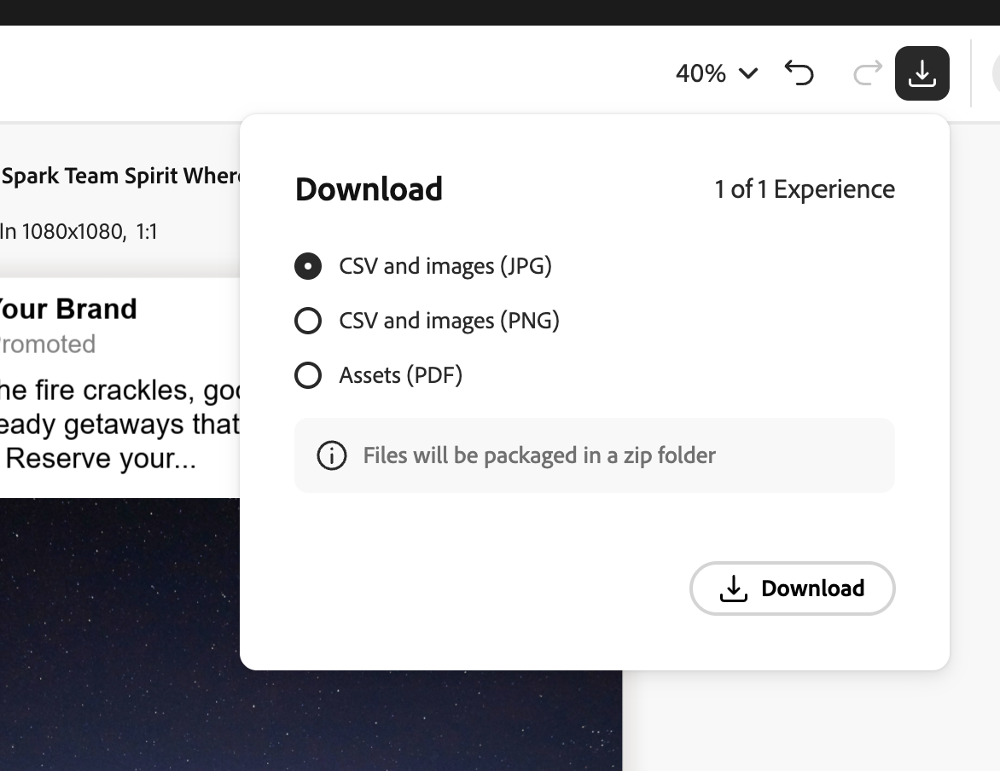
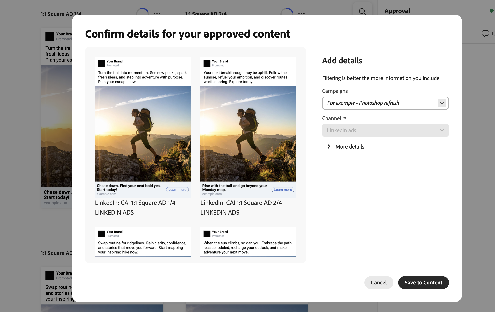
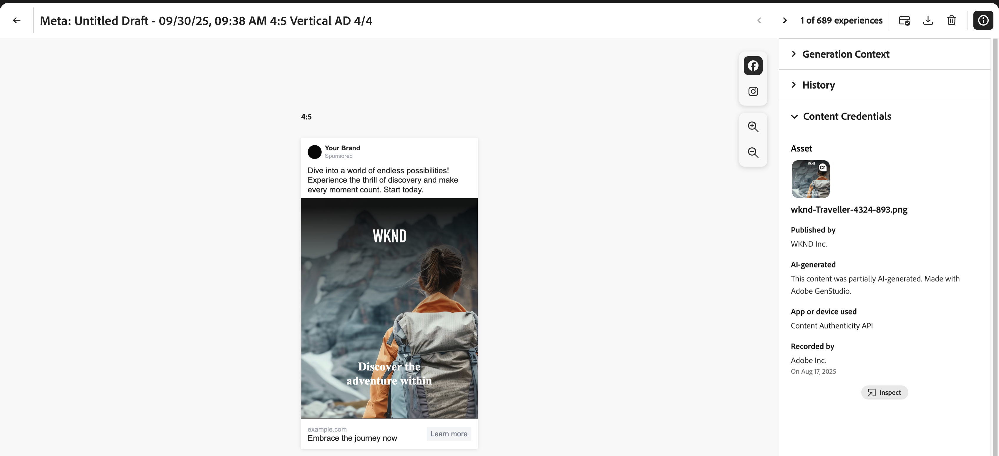

# 조직용 Content Credentials

브랜드 신뢰성을 입증하고 규정 준수를 유도하는 컨텐츠에 대한 변조 불가능한 자격 증명이 마케팅 워크플로우에 직접 임베드되는 방법에 대해 알아봅니다.

## Content Credentials 시작하기 {#content-credentials}

>[!CONTEXTUALHELP]
>id="gspm_content_credentials"
>title="[!DNL GenStudio for Performance Marketing]의 Content Credentials"
>abstract="브랜드 신뢰성을 입증하고 규정 준수를 유도하는 콘텐츠에 대한 변조 불가능한 자격 증명을 마케팅 워크플로에 직접 임베드할 수 있습니다."

GenStudio for Performance Marketing은 Content Credentials을 모든 자산에 자동으로 전역적으로 적용합니다. 설정 단계 및 자산별 설정 없음 을 켜면 됩니다. 마케팅 워크플로우 전반에 걸쳐 자격 증명이 임베드되고, 보존되고, 새로 고쳐집니다.

콘텐츠가 게시되면 Content Credentials은 LinkedIn과 같은 외부 플랫폼에 표시됩니다.

C2PA 호환 Content Credentials은 인증서 설정이 필요하지 않습니다. 브랜드 서명은 예외입니다. 조직의 자체 서명으로 콘텐츠에 서명하려면 관리자가 Admin Console 내에서 유효한 X.509 인증서를 업로드해야 합니다. 이 단계에서는 기업의 디지털 서명이 올바르게 구성되어 지원되는 Adobe DX 애플리케이션에서 사용할 수 있도록 준비됩니다.

## Content Credentials란? 

Content Credentials은 콘텐츠 제작 방법과 크리에이터에 대한 ID 정보에 대한 세부 정보가 포함된 지속적이고 업계 표준 유형의 메타데이터입니다. Content Credentials은 지원 플랫폼에 콘텐츠를 온라인으로 게시할 때 또는 [Adobe의 검사 도구](https://contentauthenticity.adobe.com/inspect) 또는 [Adobe Content Authenticity Chrome 브라우저 확장](https://helpx.adobe.com/creative-cloud/help/cai/adobe-content-authenticity-chrome-browser-extension.html)과 같은 도구를 사용하여 볼 수 있습니다.  

Content Credentials을 적용하면 콘텐츠 제작 방식에 대한 투명도를 높이고 사용자가 콘텐츠에 직접 연결할 수 있습니다.

Adobe에서 [Content Credentials에 대해 자세히 알아보세요](https://helpx.adobe.com/kr/creative-cloud/help/content-credentials.html).

## 브랜드 서명 및 자산 추적

브랜드 서명 콘텐츠는 브랜드 무결성과 사용자 신뢰를 증진하는 데 중요한 역할을 합니다. 조직은 인증서가 Admin Console에 올바르게 구성된 경우 Adobe 애플리케이션에서 고유한 브랜드 서명으로 콘텐츠에 서명할 수 있습니다. 이러한 신뢰성 보증은 보이지 않는 워터마크 및 지문 기술을 사용하여 유지되므로 콘텐츠의 라이프사이클 전반에 걸쳐 서명 내구성을 유지하는 데 도움이 됩니다.

기업은 브랜드 서명 외에도 자산 ID를 콘텐츠에 직접 첨부할 수 있습니다. 이를 통해 특히 소셜 미디어 플랫폼에서 자산을 공유하거나 게시할 때 자산을 효율적으로 추적할 수 있습니다. 자산 ID를 통합하여 콘텐츠의 출처 및 배포 경로를 추적할 수 있으므로 감독 및 책임을 강화할 수 있습니다.

## 마케팅 워크플로우의 Content Credentials

Content Credentials을 적용하는 것은 가져오기 및 콘텐츠 검색에서 활성화 및 내보내기에 이르기까지 GenStudio for Performance Marketing에서 직접 마케팅 워크플로우 전반에 걸쳐 수행할 수 있습니다. 또한 앱 전체에서 검토할 수 있도록 콘텐츠에 표시된 자격 증명을 찾을 수 있습니다.

### 가져오기 및 검색

가져온 에셋에는 콘텐츠 갤러리에서 자격 증명이 표시됩니다.

썸네일의 오른쪽 위 모서리에 있는 Content Credential 배지는 [!UICONTROL 브랜드 서명] 콘텐츠를 나타냅니다.

서명된 콘텐츠를 선택하면 자세한 메타데이터(게시된 브랜드, 레코더, 도구 사용, 타임스탬프)가 표시됩니다.

콘텐츠는 자격 증명 상태별로 필터링될 수 있습니다.

### 만들기 및 선택

Content Credential 배지는 캔버스 에셋 선택기에 표시됩니다.

자격 증명 메타데이터는 편집 전반에 걸쳐 provenance chain을 유지하기 위해 경험을 위한 자산이 선택되므로 유지됩니다.

캔버스 자산 선택기의 

### 편집 및 변환

초안에서 내보내는 동안 수정된 자산은 자동으로 다시 서명되고 새 자격 증명이 원본에 연결됩니다.

{width="60%"}

### 검토 및 승인

검토 및 승인 미리 보기에서 오른쪽 레일의 에셋에 대한 자격 증명 상태가 표시됩니다.

{width="60%"}

변형별 자격 증명 세부 정보는 검토자가 자산을 검사할 때 표시됩니다. 사용자가 **[!UICONTROL 콘텐츠에 저장]**&#x200B;을 클릭하면 승인된 경험이 다시 서명됩니다.

### 활성화 및 내보내기

활성화 중에 경험 선택기에 자격 증명 상태가 표시됩니다.

{width="60%"}

내보낸 파일에는 C2PA 호환 자격 증명이 포함됩니다.

내보낸 자산도 계보를 유지합니다. 포함된 자격 증명은 내보내기가 파생된 자산을 기록하므로 원래 가져온 자산을 편집하여 내보낸 경험을 추적할 수 있습니다. 이 계보는 파일 내에서 이동하기 때문에 에셋이 GenStudio for Performance Marketing을 떠난 후에도 검사 가능한 상태로 유지됩니다.

지원되는 모든 형식(JPEG, PNG, MP4)에서 자격 증명 무결성이 유지됩니다.

## 관련 정보

* [컨텐츠 투명도](https://experienceleague.adobe.com/en/docs/cx-enterprise-ai/experience-cloud-ai/overview/content-transparency)
* Adobe의 [Content Credentials](https://helpx.adobe.com/kr/creative-cloud/help/content-credentials.html)
