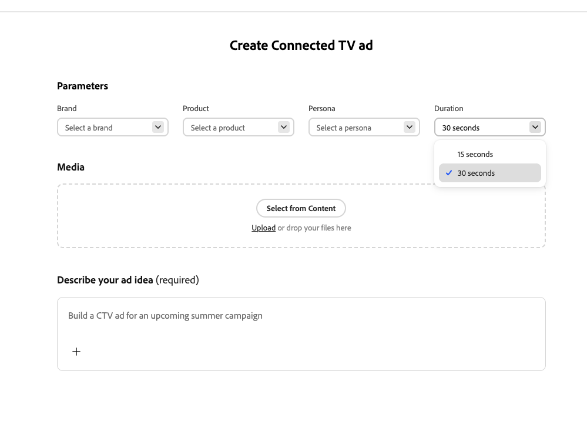

# 연결된 TV 경험 만들기

[!DNL GenStudio for Performance Marketing]의 [[!DNL Create]](/help/user-guide/create/overview.md)을(를) 사용하여 연결된 TV(CTV) 광고를 생성, 장면 기반 개선, 승인 및 게시자 준비 내보내기에 이르기까지 간략하고 공유된 가이드라인에서 한 곳에 빌드합니다. 아래 워크플로는 완전히 [!DNL GenStudio for Performance Marketing]에서 실행됩니다. 별도의 CTV 앱 또는 게시자 임베드가 없습니다.

## 사전 요구 사항

CTV 광고를 만들기 전에 다음을 확인하십시오.

* [!DNL GenStudio for Performance Marketing]에 액세스.
* **[!DNL Brands]**, **[!DNL Products]** 및 **[!DNL Personas]**&#x200B;이(가) [!DNL GenStudio for Performance Marketing]에서 공유 개체로 구성되었습니다. 이러한 개체가 생성을 알리는 방법을 이해하려면 [지침 개요](/help/user-guide/guidelines/overview.md)를 참조하십시오.
* Campaign 에셋(비디오 클립, 이미지, 로고, 음악)이 권장되지만 필수는 아닙니다. 에셋이 누락되거나 불완전한 경우 생성 AI가 공백을 메울 수 있습니다.

## 새 CTV 광고 만들기

이 워크플로의 모든 작업은 [!DNL GenStudio for Performance Marketing] 내에서 수행됩니다.

{width="50%"}
**CTV 제작으로 이동하려면**:

1. [!DNL GenStudio for Performance Marketing]에 로그인합니다.
1. 홈 또는 만들기 화면에서 **[!UICONTROL 만들기]**(으)로 이동합니다.
1. CTV 생성 카드를 사용하여 **CTV**&#x200B;을(를) 선택하십시오.
1. **[!UICONTROL CTV 광고 만들기]**&#x200B;를 클릭합니다.

간소화된 단일 CTV 생성 경험이 열립니다. 먼저 광고 유형을 선택할 필요는 없습니다.

## 개요 구성

개요 및 입력은 광고 생성 방법을 유도합니다. 광고 생성 프로세스에 대한 컨텍스트와 제약 조건을 제공할 수 있습니다.

{width=80%&quot; align=&quot;center&quot;}

**개요를 구성하려면**:

1. 기존 공유 개체에서 **[!DNL Brands]**, **[!DNL Products]** 및 **[!DNL Personas]**&#x200B;을(를) 선택합니다.
1. 직접 입력하거나 업로드하여 **creative brief**&#x200B;을(를) 추가합니다. 캠페인 목표, 주요 메시지 및 제한 사항을 포함합니다.
1. **광고 기간**&#x200B;을 15초 또는 30초로 설정합니다.
1. 필요한 경우 **자산**&#x200B;을(를) 추가합니다. 비디오 클립, 이미지, 로고, 음악, 보이스오버 또는 인트로/아웃트로 카드(드래그 앤 드롭 또는 파일 선택)를 업로드하거나 [!DNL Content] 저장소에서 에셋을 선택하십시오.
1. **[!UICONTROL 생성]** 단추를 클릭합니다.

에셋이 없거나 불완전한 경우 [!DNL GenStudio for Performance Marketing]에서 AI를 사용하여 누락된 장면, 음악 또는 음성을 생성할 수 있습니다. 제공한 Assets은 항상 생성된 재료보다 우선합니다.

[!DNL GenStudio for Performance Marketing] 자동:

* **[!DNL Brands]**, **[!DNL Products]** 및 **[!DNL Personas]**&#x200B;의 컨텍스트와 함께 개요를 해석합니다.
* 전체 CTV 광고 구조를 어셈블합니다.
* 필요에 따라 장면, 텍스트 오버레이, 음악 및 음성을 만듭니다.
* CTV 규격 지속 시간 및 형식을 적용합니다.

그 결과 기본 초안 타임라인이 아니라 완전히 형성되며 미리 볼 수 있는 CTV 광고가 표시됩니다.

## 광고 편집 및 세분화

장면 기반 편집기를 사용하여 모든 것을 다시 생성하지 않고 광고를 세분화합니다.

장면 스트립에서 장면을 클릭하여 편집할 수 있도록 엽니다. 수행할 수 있는 편집 내용은 다음과 같습니다.

* 단일 장면을 AI로 대체하거나 재생성합니다.
* 장면 프롬프트를 편집하여 변형을 만듭니다.
* 장면 순서를 조정하거나 트리밍합니다.
* 텍스트 오버레이 편집.
* 음악과 음성을 교환, 음소거 또는 교체합니다.
* 장면 간 전환을 조정합니다.

편집의 범위가 지정되므로 한 번에 한 장면씩 다시 생성하여 보다 빠르게 반복하고 창의적으로 새로 고칠 수 있습니다.

>[!NOTE]
>
>편집기에서 항목 제거, 제품 색상 변경, 사람 표시 방법 변경 등 비디오 클립의 개체 *내부*&#x200B;를 변경할 수 없습니다.

## 검토 및 승인

통합 승인 워크플로우를 사용하여 브랜드 검토를 위한 광고를 제출합니다. 브랜드 및 관련자 검토자는 메시징, 시각 자료 및 브랜드 준수 여부를 확인합니다. 승인자는 광고의 유효성을 검사합니다. 마케터 대신 비디오 편집을 수행하지 않아도 됩니다.

## 내보내기

승인 후 다음을 수행할 수 있습니다.

* 완료된 CTV 광고를 게시자 준비가 된 호환 형식으로 내보냅니다.
* [!DNL Content]에 다시 광고를 저장합니다.
* 다운스트림 CTV 구매 및 트래픽 워크플로우에서 이를 활용합니다.

Creative은 다시 인코딩하거나 다시 작업하지 않고 활성화할 수 있도록 준비되었습니다.
