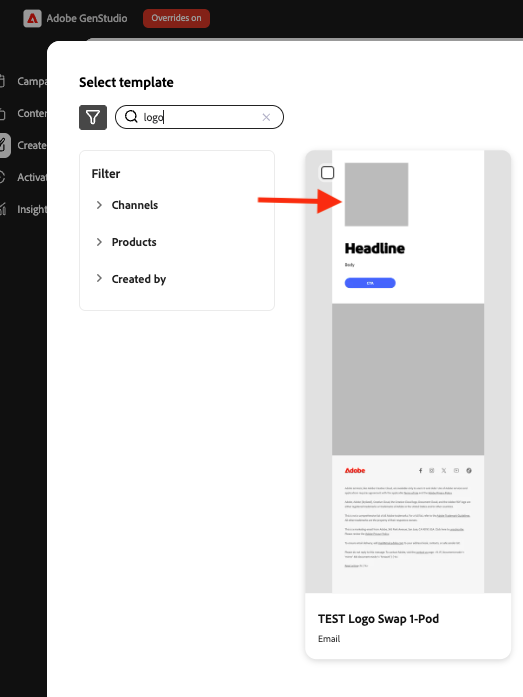
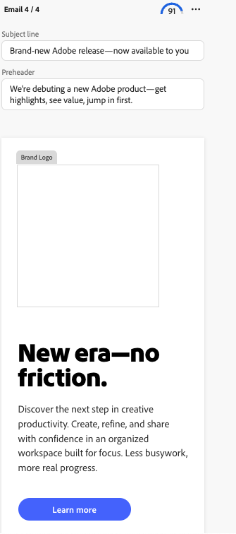
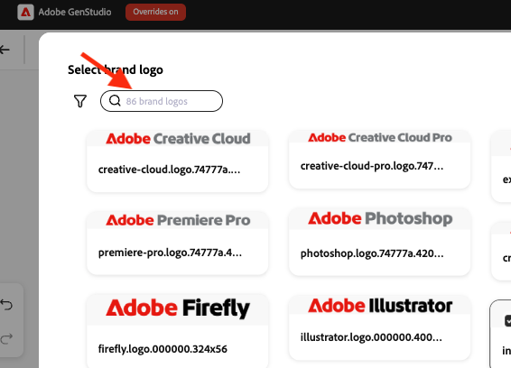
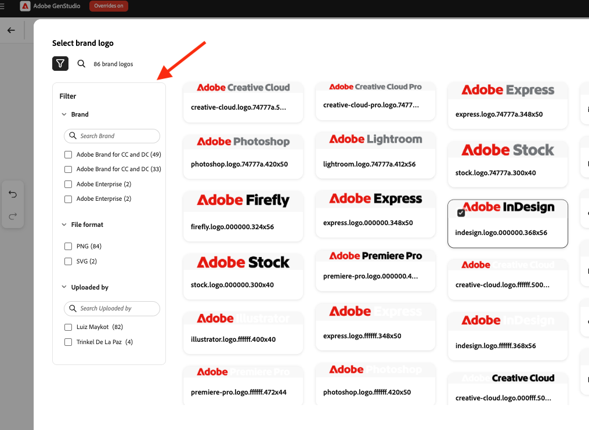

# [!DNL Create]에서 로고 교체 사용

[!DNL GenStudio for Performance Marketing]에서 콘텐츠를 만드는 동안 템플릿에서 브랜드 로고를 바꾸려면 로고 바꾸기를 사용하십시오.

## 사전 요구 사항

- [로고 교체 설정 가이드](logo-swap-setup.md)를 사용하여 템플릿을 설정합니다. 로고 교체 아이콘은 필요한 로고 자리 표시자를 포함하는 템플릿에 대해서만 나타납니다.
- **[!DNL Create]** 작업 과정에서 상호 교환 가능한 로고가 있으려면 **[!DNL Brands]** 내에 로고가 저장되어 있어야 합니다.

## 콘텐츠를 만드는 동안 로고 교체

1. **[!DNL Create]**&#x200B;에서 랜딩 페이지의 채널을 선택하십시오.
1. 스왑 가능한 로고가 포함된 템플릿을 선택합니다. 템플릿 미리 보기에는 로고가 나타나는 회색 자리 표시자 상자가 표시됩니다.
   {width="300"}
1. 평소대로 콘텐츠를 만듭니다. 4개의 변형이 나타납니다.
1. 로고 영역 위로 마우스를 가져가 자리 표시자를 표시합니다.
   {width="200"}
1. 브랜드 로고 영역을 클릭한 다음 **[!UICONTROL 콘텐츠에서 교체]**&#x200B;를 클릭합니다.
   {width="200"}
1. Brand Logo 패널에서 로고를 선택한 다음 **[!UICONTROL 사용]**&#x200B;을 클릭하여 현재 변형에 적용하거나 **[!UICONTROL 모든 변형에 적용]**&#x200B;을 클릭하여 4개 변형 모두에 적용합니다.
1. 브랜드 이름이나 필터별로 검색 로고를 사용하여 로고를 찾을 수도 있습니다.
   {width="300"}
1. 또는 필터 검색을 사용하여 로고를 찾습니다.
   {width="300"}
1. 로고가 성공적으로 교체된 상태에서 콘텐츠 만들기 워크플로를 계속합니다(초안 닫기, 내보내기 또는 승인 요청).

로고는 언제든지 다시 교체할 수 있습니다.

>[!NOTE]
>로고 교체 아이콘이 나타나지 않으면 서식 파일이 로고 교체에 대해 구성되어 있는지, 그리고 로고가 [!DNL Brands]에서 사용 가능한지 확인하십시오.
