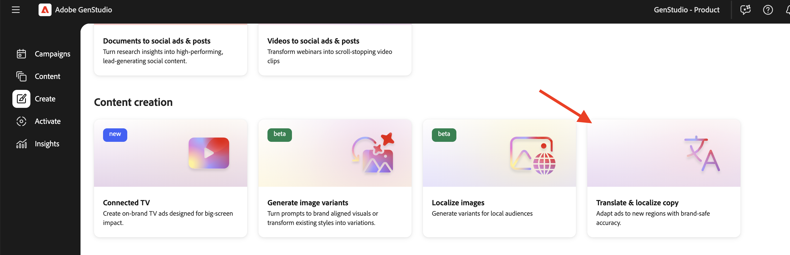

# 경험 번역 및 현지화

Adobe [!DNL GenStudio for Performance Marketing]은(는) HTML 캔버스에서 기본 번역을 제공하므로 전역 및 지역 마케터는 외부 번역 도구 없이 승인된 경험을 여러 언어로 확장할 수 있습니다.

이 기능은 기본적으로 Azure Open AI를 사용합니다. 조직은 [번역 확장](/help/extensibility/deploy-app.md#find-translation-extensions)을 통해 기본 번역 서비스를 연결할 수도 있습니다.

[!DNL Content]에 저장된 승인된 경험에서 번역을 시작합니다. 소스 경험은 모든 언어로 할 수 있습니다. 번역된 각 변형은 [!DNL Create] 캔버스에서 편집 가능한 초안으로 열려 별도의 경험으로 내보내고, 검토용으로 보내고, 게시할 수 있습니다.

## 지원되는 경험

HTML 캔버스에서 즉시 사용 가능한 번역은 다음을 지원합니다.

* [전자 메일 환경](/help/user-guide/create/email-experiences.md)
* [Meta](/help/user-guide/create/meta-experiences.md), [LinkedIn](/help/user-guide/create/linkedin-experiences.md) 및 [디스플레이](/help/user-guide/create/display-ad-experiences.md) 광고를 포함한 유료 미디어 경험

## 시작하기에 앞서

번역할 경험이 **승인됨**&#x200B;이고 [!DNL Content] _[!UICONTROL 경험]_ 갤러리에서 사용 가능한지 확인하십시오. 초안 또는 검토 중인 경험은 적격한 번역 소스가 아닙니다.

조직에서 사용자 정의 번역 확장을 등록하는 경우 GenStudio for Performance Marketing은 기본 Azure Open AI 번역 대신 해당 서비스를 사용합니다. [번역 확장 찾기](/help/extensibility/deploy-app.md#find-translation-extensions)를 참조하세요.

## [!DNL Create]에서 번역 {#translate-from-create}

승인된 경험을 현지화하려면 [!DNL Create] 랜딩 페이지에서 번역을 시작하십시오.

{width="600" zoomable="yes"}에서 복사본 번역 및 현지화

[!DNL Create]&#x200B;**에서 번역하려면**:

1. [!DNL Create]에서 _콘텐츠 만들기_ 섹션으로 스크롤합니다.
1. **[!UICONTROL 복사본 번역 및 지역화]**&#x200B;를 클릭합니다.
1. 번역할 승인된 이메일 또는 유료 미디어 경험을 선택합니다. **[!UICONTROL 사용]** 단추를 클릭합니다.
1. 지원되는 언어 목록에서 대상 언어를 선택합니다. **[!UICONTROL 번역]**&#x200B;을 클릭합니다.

번역된 변형은 캔버스에 표시됩니다.

## [!DNL Content]에서 번역 {#translate-from-content}

승인된 경험을 탐색할 때 [!DNL Content]부터 번역을 시작할 수도 있습니다.

### 경험 갤러리에서

{width="500" zoomable="yes"}

**경험 갤러리에서 번역하려면**:

1. [!DNL Content]에서 **[!UICONTROL 경험]** 탭을 엽니다.
1. 번역할 승인된 경험을 찾습니다.
1. 경험 카드에서 옵션(세 점) 메뉴를 클릭합니다.
1. **[!UICONTROL 번역]**&#x200B;을 클릭합니다.
1. 지원되는 언어 목록에서 대상 언어를 선택합니다. **[!UICONTROL 번역]**&#x200B;을 클릭합니다.

## 캔버스에서 번역 작업

HTML 캔버스에서 소스 경험은 이미 승인되었기 때문에 편집할 수 없습니다. 이메일 소스 경험이 잠긴 것으로 표시됩니다. 캔버스에서 직접 번역된 변형의 텍스트를 편집할 수 있습니다. 변형 복사본 편집에 대한 지침은 [변형 관리](/help/user-guide/create/manage-variants.md)를 참조하십시오.

번역된 경험은 브랜드 유효성 검사를 실행하거나 브랜드 점수를 표시하지 않습니다. 소스 경험은 이미 브랜드 가이드라인으로 생성되었으며, 검토 및 승인되었습니다.

번역된 경험은 조각 재생성을 지원하지 않습니다.

### 번역된 언어 삭제

**캔버스에서 번역된 언어를 제거하려면**:

1. [!DNL Create] 캔버스에서 번역된 변형 헤더의 옵션(세 점) 메뉴를 클릭합니다.
1. **[!UICONTROL 삭제]**&#x200B;를 클릭합니다.

{width="500" zoomable="yes"}

번역된 언어는 캔버스에서 제거됩니다.

### 유료 미디어 번역 새로 고침

번역된 유료 미디어 사본을 편집한 후 원본 번역 출력을 다시 로드할 수 있습니다.

**유료 미디어 번역을 새로 고치려면**:

1. [!DNL Create] 캔버스에서 편집한 번역된 변형의 옵션 메뉴를 엽니다.
1. **[!UICONTROL 번역 새로 고침]**&#x200B;을 클릭합니다.

>[!NOTE]
>
>번역 새로 고침은 유료 미디어 경험에 사용할 수 있습니다. 현재 이메일 번역은 새로 고침 번역을 지원하지 않습니다.

## 내보내기, 검토 및 게시

번역이 캔버스에 로드되면 이를 내보내고 승인을 위해 보내고 승인된 변형을 [!DNL Content]에 게시할 수 있습니다.

**번역된 경험을 내보내려면**:

1. [!DNL Create] 캔버스에서 도구 모음의 **[!UICONTROL 내보내기]**&#x200B;를 클릭합니다.
1. 내보내기 형식을 선택합니다.
   * 이메일: **CSV 및 이미지** 또는 **HTML 전용**
   * 유료 미디어: **CSV + JPG**, **CSV + PNG** 또는 **HTML + 이미지**
1. **[!UICONTROL 내보내기]**&#x200B;를 클릭합니다.

[경험을  [!DNL Content]](/help/user-guide/content/manage-assets.md#export-experiences)에서 내보낼 수도 있습니다.

**검토 및 승인을 요청하려면**:

1. [!DNL Create] 캔버스에서 **[!UICONTROL 승인 요청]**&#x200B;을 클릭합니다.
1. 최소 한 명 이상의 승인자를 지정하고 요청을 보냅니다.

검토 워크플로에 대한 자세한 내용은 [검토 및 승인 요청](/help/user-guide/approvals/request-review.md)을 참조하십시오.

**승인된 번역 게시**:

1. 승인자가 번역된 변형을 승인하면 **[!UICONTROL 게시]**&#x200B;를 클릭합니다.
1. 게시 창에서 캠페인 이름, 시간대, 지역 및 키워드와 같은 메타데이터를 확인합니다.

[승인된 콘텐츠 게시](/help/user-guide/approvals/publish-content.md)를 참조하십시오.

게시된 각 번역은 별도의 경험으로 [!DNL Content]에 저장됩니다.

## 번역된 경험 메타데이터

게시된 번역에는 다음을 포함하여 각 변형을 소스에 다시 연결하는 메타데이터가 포함됩니다.

* **제목** — `Translation from "Summer campaign" Meta`과(와) 같은 `Translation from "<source title>" <channel>` 패턴을 따릅니다.
* **작성자** - 번역을 시작한 사용자
* **만든 날짜** — 번역 날짜
* **번역된 소스** — [!DNL Content]의 소스 경험에 대한 링크
* **변환 원본** — 원본 언어

## 제한 사항

HTML 캔버스에서 경험을 번역할 때 다음 제한 사항을 염두에 두십시오.

* 원본 경험이 이미 승인되어 [!DNL Content]에 저장되어야 합니다.
* 브랜드 유효성 검사는 번역된 변형에서 실행되지 않습니다.
* 번역된 경험에서는 조각 재생성이 지원되지 않습니다.
* 번역 새로 고침은 유료 미디어에 대해서만 사용할 수 있습니다.

## 관련 정보

* [전자 메일 환경](/help/user-guide/create/email-experiences.md)
* [Meta 경험](/help/user-guide/create/meta-experiences.md)
* [광고 경험 표시](/help/user-guide/create/display-ad-experiences.md)
* [자산 및 경험 관리](/help/user-guide/content/manage-assets.md)
* [번역 확장 찾기](/help/extensibility/deploy-app.md#find-translation-extensions)
