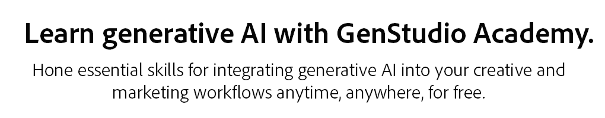
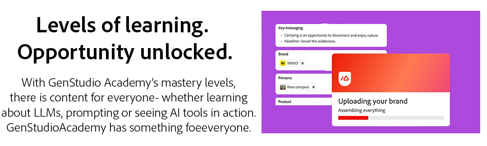
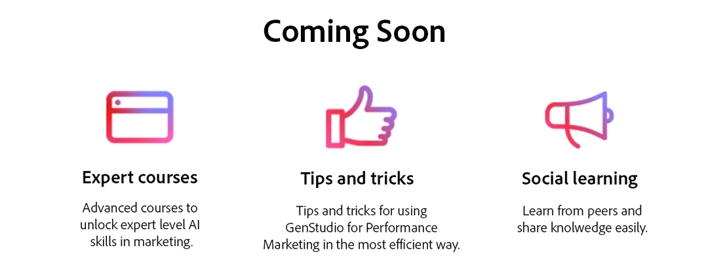

# GenStudio 아카데미

<table>

 <tr style="border: 0;">

   <td></td>

   <td rowspan="2"></td>

 </tr>

 <tr>

   <td>[!BADGE Register]{type=Informative url="https://learningmanager.adobe.com/accountiplogin?ipId=16970&amp;accesskey=c4988oojirhb5" tooltip="GenStudio Academy 계정 만들기"}       [!BADGE Log in]{type=Informative url="https://genstudioacademy.adobelearningmanager.com/" tooltip="GenStudio Academy에 로그인"}</td>

 </tr>

</table>

>[!BEGINSHADEBOX]

<table>

 <tr style="border: 0;">

  <td></td>

  <td></td>

 </tr>

 <tr>

   <td>

   </td>

   <td>

   [!BADGE 지금 살펴보기]{type=Informative url="https://learningmanager.adobe.com/accountiplogin?ipId=16970&amp;accesskey=c4988oojirhb5" tooltip="GenStudio Academy에 로그인"}

   </td>

 </tr>

</table>

>[!ENDSHADEBOX]

>[!BEGINSHADEBOX]

<table>

 <tr style="border: 0;">

  <td></td>

  <td></td>

 </tr>

 <tr>

   <td>

   </td>

   <td>

   [!BADGE 이동하기]{type=Informative url="https://business.adobe.com/products/genstudio-for-performance-marketing.html" tooltip="business.adobe.com에서 자세히 알아보기"}

   </td>

 </tr>

</table>

>[!ENDSHADEBOX]
