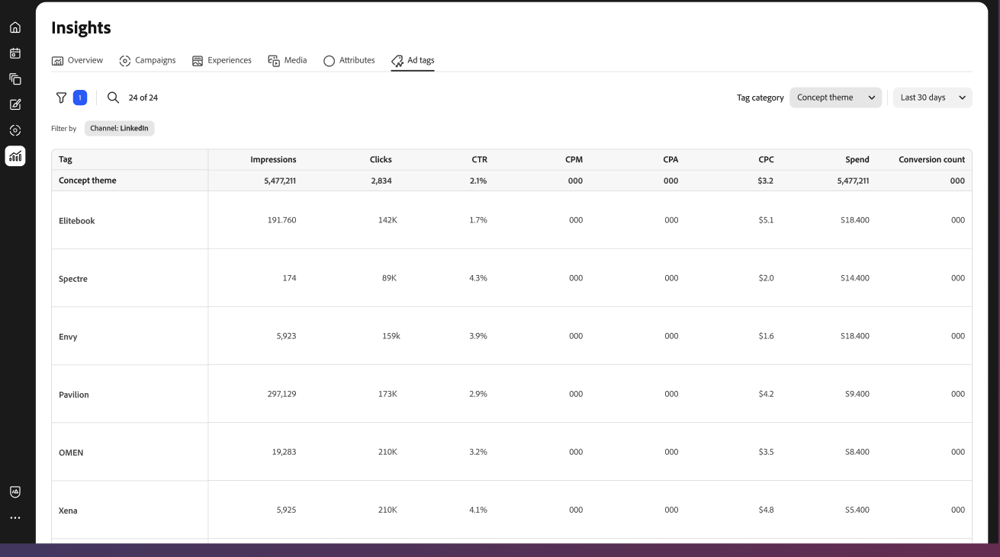

# 광고 태그 개요

[!DNL Insights] _[!UICONTROL 광고 태그]_ 보기에는 연결된 채널 광고 계정에 대한 광고 목록이 표시됩니다. _ad_&#x200B;은(는) 마케팅 캠페인의 일부로 특정 대상자에게 배포하기 위한 시각적 및 대화형 콘텐츠가 포함된 홍보 자산입니다.

{{connect-insights}}

_[!UICONTROL 광고 태그]_ 테이블은 [!UICONTROL 광고 이름]을 사용하여 구성됩니다. 표 오른쪽 위의 설정(cog) 아이콘을 클릭하여 볼 수 있는 열을 전환합니다.

_[!UICONTROL 광고 태그]_ 갤러리 보기에는 광고 미리 보기의 콜라주와 지표(예: 클릭스루 비율)가 표시됩니다. 갤러리 오른쪽 위에 있는 설정(cog) 아이콘을 클릭하여 **[!UICONTROL 카드 설정]**&#x200B;을 열고 볼 수 있는 세 가지 지표 중 하나를 전환합니다.

- CPA(작업당 비용)
- CTR(클릭스루 비율)
- CPC(클릭당 비용)
- 지출

{{filter-table}}
