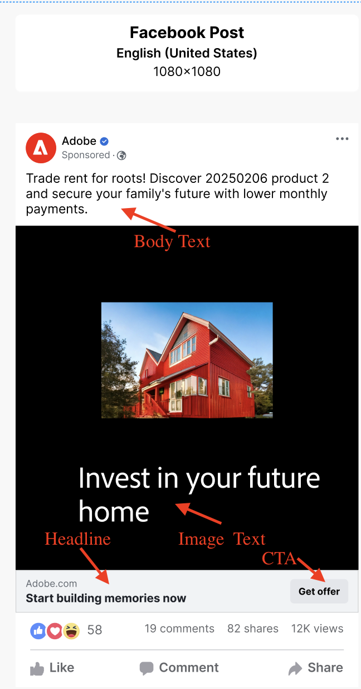
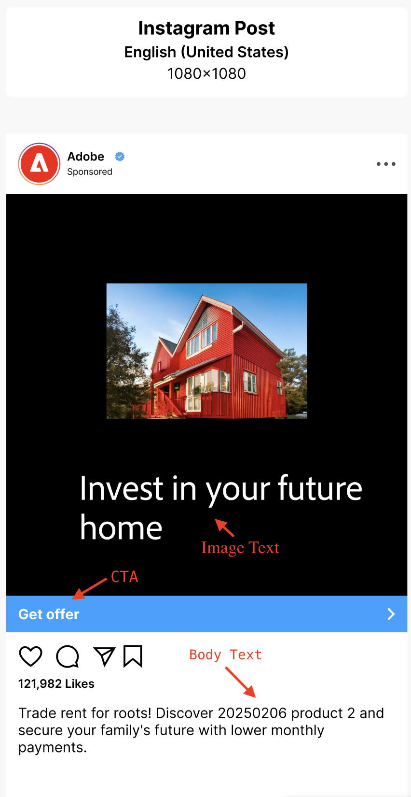
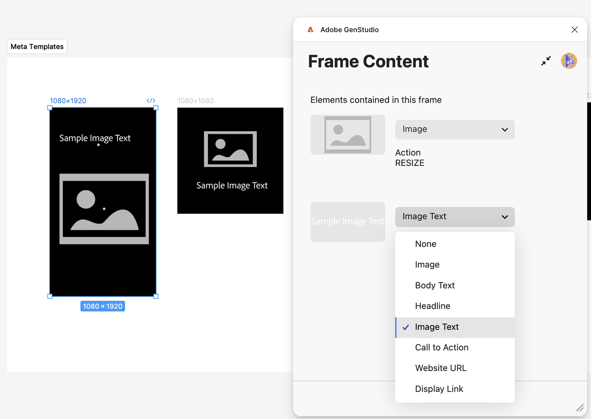
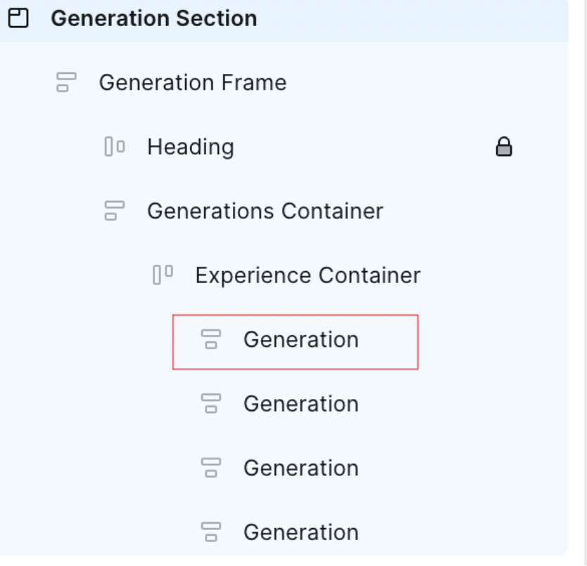
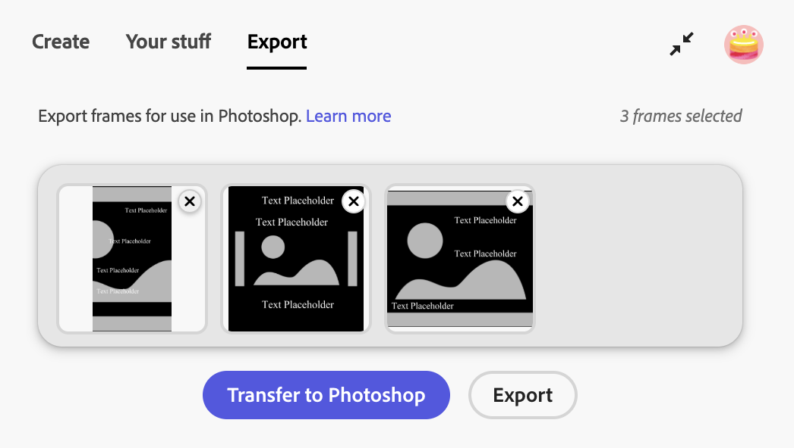

# GenStudio for Performance Marketing용 Figma 플러그인

GenStudio for Performance Marketing Figma 플러그인은 Figma 애플리케이션에 온-브랜드 콘텐츠를 생성할 수 있는 새 패널을 추가합니다.
[Figma 커뮤니티 마켓플레이스에서 플러그인을 찾아 설치합니다](https://www.figma.com/community/plugin/1604251370122180013/firefly-enterprise-and-genstudio).

이 페이지에서는 플러그인을 구성하고 사용하는 방법에 대해 설명합니다.

이 플러그인의 기능은 다음과 같습니다.

* 그림 텍스트 요소를 `headline`, `body`, `on_image_text` 등 GenStudio for Performance Marketing 필드에 매핑합니다.
* 브랜드, 사용자, 제품 및 텍스트 프롬프트를 기반으로 새 On-Brand Meta, LinkedIn 또는 Display 광고 [!DNL Experiences]을(를) 생성합니다.
* 매핑된 Figma 요소의 텍스트를 GenStudio for Performance Marketing에서 생성된 값으로 바꾸어 Figma 문서에서 직접 [!DNL Experiences]을(를) 만듭니다.
* 프롬프트에 따라 기존 콘텐츠를 다시 구문 분석, 단축, 길이 조정 또는 번역할 수 있습니다.
* 생성된 [!DNL Experiences]을(를) 여러 언어로 번역합니다.
* 생성된 [!DNL Experiences]을(를) 병합된 이미지로 로컬 원본으로 내보냅니다.
* 생성된 [!DNL Experiences]을(를) GenStudio for Performance Marketing으로 내보냅니다.
* 그림 캔버스에서 선택한 요소에 맞게 조정하는 플러그인 옵션을 사용합니다.

>[!VIDEO](https://video.tv.adobe.com/v/3478816?captions=kor&learn=on)

## 템플릿 만들기

플러그인을 사용하려면 Figma 문서의 처음 두 수준이 이 규칙을 따라야 합니다.

* **섹션** - 여러 템플릿을 포함할 수 있는 상위 프로젝트를 나타냅니다.
* **프레임** - 프로젝트 내의 템플릿을 나타냅니다. 템플릿은 텍스트, 이미지, 구성 요소 및 기타 요소로 채울 수 있습니다.

### Meta 템플릿

지원되는 템플릿 크기는 다음과 같습니다.

Instagram 또는 Facebook 게시물의 경우:

* 너비: 1080px(고정)
* 높이: 1080px 또는 1350px

Instagram 또는 Facebook 스토리:

* 너비: 1080px(고정)
* 높이: 1920px

플러그인은 템플릿의 높이를 기반으로 생성된 경험의 크롬을 결정합니다.

### 템플릿 표시

고정 크기 요구 사항은 없습니다. 표시 템플릿은 모든 크기를 지원합니다.

### LinkedIn 템플릿

* 너비: 1200px(고정)
* 높이: 1200px, 628px, 2292px, 1800px 또는 1500px

### 필드 역할 매핑

플러그인은 헤드라인, 본문 또는 이미지와 같은 템플릿의 다양한 요소를 이해해야 합니다.

**Meta 필드 역할 포함**:

* 이미지
* 이미지 텍스트
* CTA
* 본문
* 제목
* 웹 사이트 URL
* 링크 표시
* 수동 필드

아래에서 이러한 필드 역할 중 일부가 매핑되는 방식을 확인하십시오.

| {width="60%" align="center" zoomable="yes"}  | {width="70%" align="center" zoomable="yes"}  |
|:---:|:---:|
| {width="60%" align="center" zoomable="yes"}  | {width="70%" align="center" zoomable="yes"}  |

**LinkedIn 필드 역할에**&#x200B;이(가) 포함됩니다.

* 이미지
* 소개 텍스트
* 이미지 텍스트
* 제목
* CTA
* 웹 사이트 URL
* 수동 필드

아래에서 이러한 필드 역할 중 일부가 매핑되는 방식을 확인하십시오.

{width="30%" align="center" zoomable="yes"}

플러그인은 생성된 콘텐츠에 사용할 이러한 매핑을 기억합니다. 필드 역할은 여러 템플릿 요소에 매핑될 수 있습니다. 수동 필드는 텍스트 편집 가능성을 유지하려는 요소에 대한 것이지만 생성을 위해 표시되지 않습니다.

>[!IMPORTANT]
>
> **템플릿에 있는 하나 이상의 이미지 요소에 `image` 필드 역할을 할당하여**&#x200B;이미지를 매핑해야 합니다.

요소 역할을 할당하려면

1. 템플릿에서 요소(텍스트, 이미지 등)를 선택합니다.
1. 드롭다운 메뉴를 사용하여 역할을 할당합니다.

{width="60%" zoomable="yes"}

{{$include /help/_includes/field-mapping-exceptions.md}}

## 새 콘텐츠 생성

GenStudio for Performance Marketing AI를 사용하여 그림 템플릿의 요소를 생성하거나 변형할 수 있습니다.

1. GenStudio 플러그인 플레이그라운드 또는 이미 준비된 템플릿을 사용하는 경우 광고 템플릿이 포함된 섹션 노드를 선택합니다. **레이어** 패널에서 수행하거나 캔버스의 섹션을 직접 클릭하여 수행할 수 있습니다.
   {width="50%" zoomable="yes"}
1. 플러그인 창에서 변형의 프로젝트 이름을 입력하고 컨텐츠의 플랫폼을 선택한 다음 기타 필수 정보를 입력합니다. 그런 다음 **[!UICONTROL 설치 완료]** 단추를 클릭합니다.
   {width="30%" zoomable="yes"}
1. 콘텐츠 생성에 사용할 [!DNL Brand], [!DNL Persona] 및 [!DNL Product]을(를) 선택하십시오.
1. 생성할 변형 수(최대 8개)를 선택합니다.
1. **[!UICONTROL 콘텐츠 선택]** 아래의 단추를 사용하여 에셋에서 이미지를 찾아보고 선택합니다. 가장 최근에 추가된 40개의 에셋이 먼저 나타나고 다른 에셋을 검색할 수 있습니다. 선택한 이미지는 템플릿에 맞게 자동으로 크기가 조정됩니다.
1. 텍스트 프롬프트를 입력합니다. **[!UICONTROL 필드]** 목록의 각 필드에는 새 콘텐츠에 대해 **[!UICONTROL 작업]** 옵션이 **[!UICONTROL 생성]**(으)로 설정되어 있습니다.
1. 모든 필드 역할을 매핑합니다. [필드 역할 매핑](#field-role-mapping)을 참조하세요.
1. **[!UICONTROL 생성]** 단추를 클릭합니다.

## 기존 콘텐츠에서 광고 복사 변형 번역 또는 생성

GenStudio for Performance Marketing AI를 사용하여 광고 카피 변형을 생성하거나 Figma 템플릿을 번역합니다.

1. 광고 템플릿이 포함된 섹션 노드를 선택합니다. **레이어** 패널에서 수행하거나 캔버스의 섹션을 직접 클릭하여 수행할 수 있습니다.
   {width="50%" zoomable="yes"}
1. 플러그인 창에서 변형의 프로젝트 이름을 입력하고 컨텐츠의 플랫폼을 선택합니다.
1. **[!UICONTROL 목표가 무엇입니까?]**&#x200B;에서 **[!UICONTROL 변형 생성]** 또는 **[!UICONTROL 번역]**&#x200B;을 선택한 다음 **[!UICONTROL 설정 완료]** 단추를 클릭합니다.
   {width="30%" zoomable="yes"}
1. 콘텐츠 생성에 사용할 [!DNL Brand], [!DNL Persona] 및 [!DNL Product]을(를) 선택하십시오.
1. 생성할 변형 수를 선택합니다.
1. **[!UICONTROL 콘텐츠 선택]** 아래의 단추를 사용하여 에셋에서 이미지를 찾아보고 선택합니다. 가장 최근에 추가된 40개의 에셋이 먼저 나타나고 다른 에셋을 검색할 수 있습니다. 선택한 이미지는 템플릿에 맞게 자동으로 크기가 조정됩니다.
1. 텍스트 프롬프트를 입력합니다. **[!UICONTROL 필드]** 목록의 각 필드에는 새 콘텐츠에 대해 **[!UICONTROL 작업]** 옵션이 **[!UICONTROL 생성]**(으)로 설정되어 있습니다.
1. 모든 필드 역할을 매핑합니다. [필드 역할 매핑](#field-role-mapping)을 참조하세요.
1. 각 필드 유형을 선택하여 변형을 생성하거나 플러그인 왼쪽의 패널에서 번역한 다음 초기 콘텐츠를 각 **[!UICONTROL 초기 콘텐츠]** 상자에 붙여 넣습니다.
   {width="60%" zoomable="yes"}
1. **[!UICONTROL 생성]** 단추를 클릭합니다.

## 생성 후 콘텐츠 번역

1. 번역할 세대를 선택합니다.
   {width="20%" zoomable="yes"}
1. **[!UICONTROL 번역]**&#x200B;을 선택한 다음 **[!UICONTROL 번역]**&#x200B;을 클릭합니다.
1. 타겟 언어를 선택합니다.
1. **[!UICONTROL 선택]**&#x200B;을 클릭합니다.

번역 결과는 다음과 같습니다.

* 번역된 콘텐츠가 있는 새 페이지가 나타납니다.
* 각 번역에는 대상 언어 또는 로케일이 표시됩니다.
* 원본 콘텐츠는 원본 페이지에서 변경되지 않은 상태로 유지됩니다.

{width="60%" zoomable="yes"}

## 생성 후 콘텐츠 필드에 대한 기타 작업

필드에서 기존 콘텐츠를 편집하는 경우 유용한 옵션이 플러그인 패널에 나타납니다.

{width="30%" zoomable="yes"}

옵션은 다음과 같습니다.

* 텍스트를 직접 변경하려면 **[!UICONTROL 값]**&#x200B;을(를) 변경하십시오. 이 콘텐츠를 변경하면 선택한 모든 변형에 자동으로 적용됩니다.
* AI는 다음을 포함한 많은 **[!UICONTROL 작업]** 옵션을 수행할 수 있습니다.

| 작업 | 설명 |
| --- | --- |
| **[!UICONTROL 생성]** | 텍스트의 새 변형을 생성합니다. |
| **[!UICONTROL 구문 변경]** | 텍스트의 새 변형을 생성합니다. |
| **[!UICONTROL 단축]** | 텍스트의 짧은 변형을 생성합니다. |
| **[!UICONTROL 길이]** | 더 긴 텍스트 변형을 생성합니다. |

**[!UICONTROL 작업]** 옵션을 선택한 후 **[!UICONTROL 다시 생성]** 단추로 콘텐츠를 다시 생성합니다.

## 경험 내보내기

Figma에서 변형을 GenStudio for Performance Marketing [!DNL Experiences]&#x200B;(으)로 내보낼 수 있습니다.

1. 다음 중 하나를 수행하여 그림 캔버스에서 내보낼 콘텐츠를 선택합니다.
   * 캔버스에서 생성 섹션을 선택한 다음 플러그인 패널에서 **[!UICONTROL 모두 내보내기 표시]**&#x200B;를 클릭합니다.
     {width="20%" zoomable="yes"}
   * 캔버스에서 개별 세대를 선택한 다음 플러그 인 패널에서 **[!UICONTROL 내보낼 표시]**&#x200B;를 클릭합니다.
     {width="20%" zoomable="yes"}
1. 사이드바 메뉴에서 내보내기 항목을 선택합니다.
   ![Meta 광고에 대해 [내보내기 표시] 단추가 표시됨](./mark-for-export.png){width="60%" zoomable="yes"}
1. 대상을 선택하십시오.
1. 콘텐츠를 내보내려면 **[!UICONTROL 내보내기]**&#x200B;를 클릭합니다.

플러그인 패널에서 ZIP 파일이 만들어지거나 **[!UICONTROL GenStudio에서 열기]**&#x200B;에 대한 링크가 나타납니다. ZIP 링크를 사용하여 파일을 저장할 위치를 선택하거나 **[!UICONTROL GenStudio에서 열기]**&#x200B;를 선택합니다.

## 그림 프레임을 Photoshop으로 변환

>[!NOTE]
>
> 이 작업을 수행하려면 Figma 플러그인과 [GenStudio Photoshop](photoshop-plugin.md)이 모두 필요합니다.

Figma 플러그인을 사용하여 Figma 프레임, 여러 프레임 또는 전체 문서를 Photoshop 형식으로 변환하고 [GenStudio Photoshop](photoshop-plugin.md)에서 사용하도록 내보낼 수 있습니다. 현재 변환 중에는 가시성, 글꼴 크기 및 기본 레이어 속성과 같은 주요 속성만 지원됩니다. 취소선, 위 첨자, 아래 첨자, 백분율 불투명도, 그라디언트 및 유사한 고급 속성과 같은 기능은 아직 지원되지 않습니다.

<!-- GS-34076: Demo video placement is hardcoded in the tool UI; keep this video above "The plugin supports the following Figma layer types for conversion." -->
>[!VIDEO](https://video.tv.adobe.com/v/3492276?captions=kor&learn=on)

플러그인은 변환을 위해 다음 Figure 레이어 유형을 지원합니다.

* **프레임**
* **그룹**
* **인스턴스**
* **텍스트**
* **벡터**
* **이미지**

PSD으로 변환하면 지원되는 레이어는 다음과 같이 Photoshop에 매핑됩니다.

| 그림 레이어 유형 | Photoshop으로 변환 | 참고 |
| --- | --- | --- |
| **프레임** | 레이어 그룹 | <ul><li>그림 프레임은 Photoshop 레이어 그룹으로 변환됩니다.</li><li>중첩된 프레임은 중첩 그룹이 됩니다.</li><li>프레임 차원은 선택에 따라 PSD 아트보드 또는 그룹 경계가 됩니다.</li></ul> |
| **그룹** | 레이어 그룹 | <ul><li>그림 그룹은 Photoshop 레이어 그룹으로 직접 변환됩니다.</li><li>레이어 계층 구조 및 스택 순서는 그대로 유지됩니다.</li></ul> |
| **인스턴스** | 레이어 그룹 | <ul><li>구성 요소와 인스턴스는 표준 Photoshop 레이어 그룹으로 병합됩니다. 구성 요소 메타데이터 및 변형 논리는 유지되지 않습니다.</li><li>모든 하위 레이어는 그룹 내부에 남아 있습니다.</li></ul> |
| **텍스트** | 텍스트 레이어 | <ul><li>그림 텍스트 레이어는 편집 가능한 Photoshop 텍스트 레이어로 변환됩니다.</li><li>텍스트 계층 구조 및 위치는 유지됩니다.</li></ul> |
| **벡터** | 모양 레이어 | <ul><li>그림 벡터 레이어는 Photoshop 모양 레이어로 변환됩니다.</li><li>가능한 경우 경로가 유지됩니다.</li><li>지원되지 않는 효과가 적용되는 경우 복합 벡터가 래스터화될 수 있습니다.</li></ul> |
| **이미지** | 래스터 레이어 | <ul><li>그림 이미지 레이어는 Photoshop 래스터 레이어로 변환됩니다.</li><li>이미지 크기 조절과 위치는 유지됩니다.</li></ul> |

### 프레임을 변환하는 방법

프레임을 변환하려면:

1. Figma에서 Firefly Enterprise 및 GenStudio 플러그인을 열고 플러그인 UI에서 **[!UICONTROL 내보내기]** 탭을 클릭합니다.
1. 캔버스에서 내보낼 프레임을 선택합니다. 단일 프레임이나 여러 프레임을 선택할 수 있습니다.

   >[!NOTE]
   >
   > 프레임은 변환하는 동안 섹션 내에 있을 수 없습니다. 단면 노드 내에 중첩되지 않은 프레임을 선택합니다.

1. 선택한 프레임을 마이그레이션하려면 다음 중 하나를 수행하십시오.

   * **[!UICONTROL 내보내기]**&#x200B;를 클릭하여 변환된 파일을 선택한 위치로 내보내거나
   * 변환된 파일을 Photoshop Photoshop에서 즉시 사용할 수 있도록 캐시하려면 **[!UICONTROL GenStudio으로 전송]**&#x200B;을 클릭합니다.
     {width="40%"}
1. 그런 다음 Figure 파일 링크를 공유합니다. 변환을 완료하려면 플러그인에 Figure 파일 URL이 필요합니다. 문서의 URL을 추가합니다.

   1. 그림에서 캔버스의 오른쪽 위 모서리에 있는 **[!UICONTROL 공유]**&#x200B;를 클릭합니다.
   1. **[!UICONTROL 이 파일 공유]**&#x200B;에서 **[!UICONTROL 링크 복사]**&#x200B;를 클릭합니다.
   1. 복사한 링크를 [!DNL GenStudio for Performance Marketing] 플러그 인 대화 상자의 **[!UICONTROL 그림 파일 링크]** 필드에 붙여 넣으십시오. 각 파일에 대해 이 작업을 수행해야 합니다.
      {width="35%"}
   1. **[!UICONTROL 제출을 클릭합니다]**.
1. 파일의 내용과 메타데이터를 읽을 수 있는 액세스 권한을 묻는 팝업이 나타납니다. 이 작업은 모든 파일에 대해 한 번만 수행하면 됩니다. **[!UICONTROL 액세스 허용]**&#x200B;을 클릭합니다. 플러그인은 선택한 프레임을 FigureMa에서 읽고 파일 데이터의 중간 형식인 JSON 문서로 변환합니다.
   {width="35%"}
1. Photoshop에서 [!DNL GenStudio Photoshop]을(를) 열고 **[!UICONTROL 가져오기]** 탭을 클릭합니다.
1. 변환된 파일을 선택하려면 다음 단계 중 하나를 수행하십시오.

   * **[!UICONTROL 플러그 인에서]**&#x200B;을(를) 클릭하여 캐시된 파일 목록에서 **[!UICONTROL GenStudio Photoshop으로 전송]**&#x200B;을(를) 사용하여 변환된 파일을 선택하거나
   * **[!UICONTROL JSON 업로드]**&#x200B;를 클릭하여 업로드할 JSON 파일을 찾아 선택합니다.
     {width="40%"}
1. GenStudio Photoshop은 JSON 문서의 정보를 열려 있는 Photoshop 문서로 변환합니다.
1. **[!UICONTROL 완료]**&#x200B;를 클릭합니다. 새 파일이 Photoshop에서 열리고 사용할 준비가 되었습니다. 또는 **[!UICONTROL 다른 이름으로 저장...]**&#x200B;을 클릭하여 파일을 저장할 위치를 선택하십시오.
   {width="40%"}

## 생성 기록

플러그인은 각 필드에 대한 변경 사항 기록을 유지 관리합니다. 템플릿 페이지의 플러그 인 사이드바에서 **[!UICONTROL 생성 기록]**&#x200B;을 선택하십시오.

{width="80%" zoomable="yes"}

## 문제 해결

생성된 변형에서 텍스트나 이미지를 대체하지 않는 경우 이러한 모범 사례와 팁을 고려하십시오.

### 매핑된 필드

텍스트 또는 이미지가 바뀌지 않는 경우 필드가 플러그인 UI에서 GenStudio 필드 역할에 매핑되었는지 확인합니다. [필드 역할 매핑](#field-role-mapping)을 참조하세요.

### 글꼴을 사용할 수 있는지 확인

생성 중에 대체하려면 시스템에서 텍스트 필드의 글꼴을 사용할 수 있어야 합니다. 파일에 사용된 모든 글꼴을 컴퓨터에서 사용할 수 있는지 확인합니다. 특히 파일이 다른 사람의 컴퓨터에서 만들어진 경우 사용할 수 있습니다.

### 필드 역할 지원 고려

특정 채널에서는 특정 필드에서만 교체를 지원합니다. [필드 역할 매핑](#field-role-mapping)에 대한 예외를 알아 두십시오.
