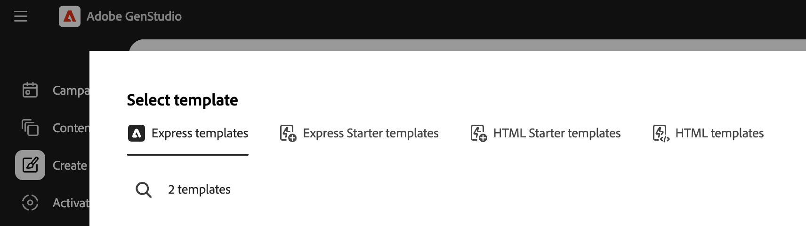
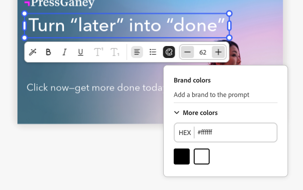
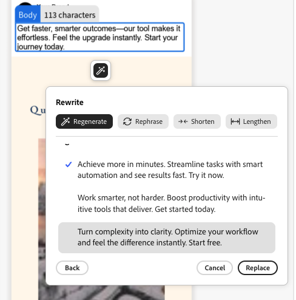
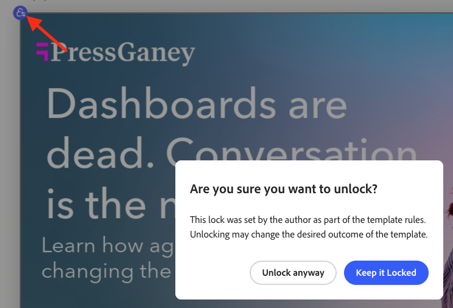
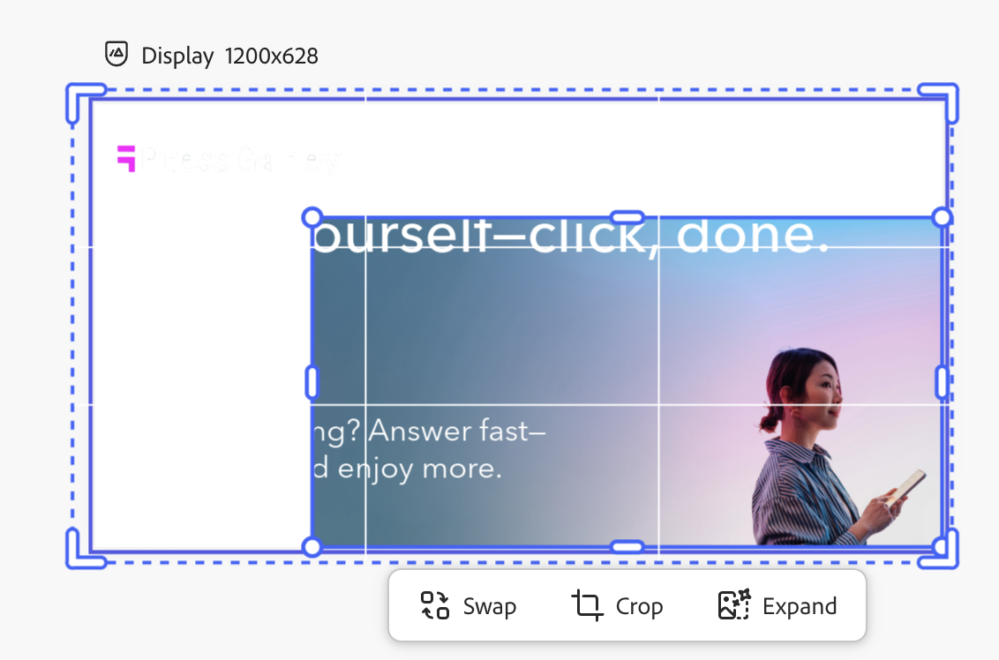
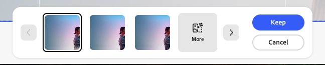

# [!DNL Adobe Express]개 템플릿 사용 중

[!DNL GenStudio for Performance Marketing]은(는) [!DNL Adobe Express]에서 만들고 디자인된 템플릿을 사용할 수 있습니다. [!DNL Adobe Express]에서 브랜드 자산을 가져와 강력한 도구를 사용하여 매력적인 마케팅 캠페인 및 [!DNL Experiences]에 통합합니다.

이 안내서에서는 [!DNL Adobe Express]의 서식 파일에 대한 요구 사항 및 기능을 설명합니다. 추가 팁과 모범 사례는 [템플릿 사용 모범 사례](/help/user-guide/templates/best-practices-for-templates.md#express-to-genstudio-template-best-practices)를 참조하세요.

## [!DNL Adobe Express]의 템플릿 정보

[!DNL Adobe Express]에서 응용 프로그램에 제공된 기존 시작 템플릿](https://helpx.adobe.com/express/web/documents-and-presentations/text-flow-template.html?x-product=Helpx%2F1.0.0&x-product-location=Search%3AForums%3Alink%2F3.7.5)을 사용하거나 다음과 같이 [유용한 브랜드 제한을 포함할 수 있는 사용자 지정 템플릿](https://helpx.adobe.com/express/web/brands-libraries-projects/create-manage-brands/edit-shared-template.html)을 사용하여 [새 문서를 만들 수 있습니다.

- 변경할 수 없는 [잠긴 요소](https://helpx.adobe.com/express/web/invite-collaborate/object-locking.html)
- 필요한 경우 사용자가 요소의 잠금을 해제하는 방법을 제어하는 잠금 제한

[!DNL Adobe Express]의 템플릿에 설정된 잠금 설정이 [!DNL GenStudio for Performance Marketing]에도 적용됩니다. [지침 [!DNL Adobe Express] 을 사용하여 브랜드 제한을 가진 사용자 지정 템플릿을 만듭니다](https://helpx.adobe.com/express/web/brands-libraries-projects/create-manage-brands/template-control.html).

빠른 템플릿에서 사용자 정의 글꼴을 사용하려면 관리자는 먼저 빠른 라이선스 권한의 일부로 포함된 Admin Console에서 사용자 정의 글꼴 적격 오퍼에 동의해야 합니다.

## Express 템플릿 찾기

만들기 의 새로운 탭에 빠른 템플릿을 선택하는 메시지가 표시됩니다. 빠른 템플릿은 다음과 같은 경우에 GenStudio for Performance Marketing에서 액세스할 수 있습니다.

- 사용자가 생성함
- 사용자에게 공유됨
- 두 앱에서 동일한 IMS 조직을 사용하여 사용자의 조직에 공유됩니다

템플릿 유형을 선택한 후 만들기 워크플로우에서 사용 가능한 빠른 템플릿을 찾습니다. 빠른 템플릿은 다음 유형에만 사용할 수 있습니다.

- [!DNL Meta]
- [!DNL Display]
- [!DNL LinkedIn]
- [!DNL TikTok]

**[!UICONTROL 템플릿 선택]** 아래 상단 표시줄에서 **빠른 템플릿**&#x200B;을 찾습니다.

{width=70%}

[!DNL Express] 템플릿을 선택하고 **[!UICONTROL 사용]**&#x200B;을 클릭하면 미리 작성된 매개 변수와 프롬프트가 왼쪽의 팝업 패널에 나타납니다. 선택한 템플릿으로 새 콘텐츠를 만들려면 **[!UICONTROL 생성]** 단추를 클릭하십시오.

{width=90%}

>[!IMPORTANT]
>
>콘텐츠를 생성하는 동안 [!DNL GenStudio for Performance Marketing]에 대한 필드 역할로 빠른 템플릿 레이어에 자동으로 태그가 지정됩니다. 템플릿의 요소는 [수동으로 태그 지정](#manual-tagging-of-templates)할 수도 있습니다.

## [!DNL Adobe Express]개 서식 파일이 있는 변형 및 [!DNL Experiences] 정보

[!DNL Express] 템플릿은 [다른 변형을 관리](https://experienceleague.adobe.com/en/docs/genstudio-for-performance-marketing/user-guide/create/manage-variants#manually-edit-text)할 때 익숙한 기능과 동일한 기능을 많이 제공합니다. 그러나 [!DNL Express]의 콘텐츠에 대한 워크플로를 간소화할 수 있는 몇 가지 강력한 추가 기능이 있습니다. 이 섹션에서는 [!DNL Adobe Express] 구현에만 적용되는 기능에 대해 설명합니다.

### 여러 크기 자동 생성

[에셋에 대해  [!DNL Express]](https://helpx.adobe.com/express/web/arrange-layers-and-pages/add-pages.html)에 여러 페이지를 만들면 해당 페이지는 해당 에셋에서 만든 템플릿으로 이월됩니다. 빠른 페이지는 각각 [!DNL GenStudio for Performance Marketing]에서 다른 크기의 크리에이티브 콘텐츠로 생성됩니다.

[!DNL Express]의 에셋에 대해 크기가 지정된 콘텐츠가 여러 개 있는 경우 한 번에 모든 크기에 대해 변형을 생성할 수 있습니다.

### 요소 위치 변경 및 크기 조정

템플릿의 요소는 캔버스 창에서 해당 요소를 클릭하고 드래그하여 크기를 조정하거나 크기에 맞게 이동할 수 있습니다.

모퉁이점에서 요소를 클릭하고 드래그하여 크기를 조정합니다.

### 캔버스 창 머리글 기능

캔버스 창 헤더의 버튼을 사용하여 다음을 수행합니다.

1. 초안 다시 제목
1. 보기를 위한 확대/축소 수준 변경
1. 변경 내용 실행 취소 및 재실행

### 경험 그룹 피드백 할당

생성된 변형의 각 그룹에 피드백을 할당합니다. 이러한 피드백 레이블은 AI가 후속 세대에서 고려해야 하는 변형을 이해하는 데 도움이 됩니다.

&quot;...&quot; 클릭 드롭다운을 열려면 다음을 수행하십시오.

- 좋은 출력
- 낮은 출력
- 삭제 - 변형 그룹을 삭제합니다.

### 변형 삭제

경험 그룹에서 생성된 단일 변형 크기는 휴지통 아이콘을 사용하여 삭제할 수 있습니다.

{width=300}

### 스페이스바-투-팬

클릭하여 끌어서 캔버스 보기 창을 &quot;끌어오기&quot;할 수 있는 기능을 사용하려면 **[!UICONTROL Space]**&#x200B;을(를) 길게 누르십시오.

두 손가락으로 스크롤하여 뷰 창을 이동할 수도 있습니다.

### 수동으로 텍스트 편집

생성된 변형의 텍스트 필드를 편집할 수 있습니다. 다른 구 및 언어로 실험하고 서식을 적용하여 대상의 텍스트를 세분화합니다. 예를 들어 이미지 레이아웃에 맞게 변형의 텍스트를 굵게 및 오른쪽으로 정렬할 수 있습니다.

{width=60%}

사용 가능한 텍스트 서식은 다음과 같습니다.

- 굵게, 기울임체 및 밑줄
- 텍스트 색상(검정, 흰색 또는 브랜드 색상)
- 왼쪽, 가운데 및 오른쪽 정렬
- 글머리 기호 및 순차 목록
- 텍스트 크기
- 위 첨자 또는 아래 첨자

**생성된 변형에서 수동으로 텍스트를 편집하려면**:

1. 변형 세트를 생성한 후 변형에서 편집 가능한 텍스트를 두 번 클릭합니다.
1. 새 텍스트를 입력합니다.
1. 텍스트 서식을 지정하려면 을 클릭하거나 텍스트 상자 요소를 입력합니다. 서식 지정 옵션이 팝업 모음에 나타납니다. Shift 키를 누르면 텍스트를 볼 막대가 숨겨집니다.
1. 변경 사항을 저장하려면 텍스트 필드 바깥쪽을 클릭합니다.

### 레이어 보기

변형의 개별 레이어를 빠르게 선택하고 단면을 다시 생성하거나 이미지를 자르는 등의 변경 작업을 수행할 수 있습니다. 개별 레이어를 선택하면 레이어 내의 편집 가능한 필드 또는 이미지가 강조 표시됩니다.

**변형의 레이어를 보려면**:

1. 변형 세트를 생성한 후 변형 내에서 편집 가능한 필드 또는 이미지를 클릭합니다. 레이어는 오른쪽 상단에 있는 타일 줄에 나타납니다.
   {width=50%}
1. 레이어 타일을 클릭하여 선택합니다. 변형에 대해 선택한 레이어가 강조 표시됩니다.
1. 선택한 레이어에 필요한 편집을 계속 수행합니다.

### 섹션 다시 작성

[!DNL GenStudio for Performance Marketing]에는 생성된 변형의 섹션을 재생성하는 기본 제공 기능이 있습니다. 텍스트를 다시 만들거나, 줄이거나, 늘리거나, 새 프롬프트를 추가하여 새 콘텐츠를 생성할 수 있습니다.

예를 들어 하나의 Meta 광고 변형의 헤드라인 섹션을 다시 생성하여 특정 배경 자산과 어떻게 보이는지 확인할 수 있습니다. 섹션의 텍스트 콘텐츠를 **[!UICONTROL 다시 구문]**, **[!UICONTROL 짧게]** 또는 **[!UICONTROL 길게]**&#x200B;하거나 안내 메시지를 사용하여 텍스트를 **[!UICONTROL 다시 생성]**&#x200B;할 수 있습니다.

{width=50%}

**개별 변형 섹션을 다시 작성하려면**:

1. 변형 세트를 생성한 후 변형에서 편집 가능한 텍스트를 한 번 클릭합니다. 지팡이 아이콘이 나타납니다.
1. 자동 선택 아이콘을 클릭하여 [다시 작성] 창을 엽니다.
1. 기존 텍스트를 변경하려면 **[!UICONTROL 구문 변경]**, **[!UICONTROL 단축]** 또는 **[!UICONTROL 길이]**&#x200B;를 선택하십시오.
1. 새 구문 옵션을 생성하려면 **[!UICONTROL 다시 생성]**&#x200B;을 선택하고 새 프롬프트를 입력하십시오.
   1. **[!UICONTROL 생성]**&#x200B;을 클릭합니다.
1. 결과는 창에 옵션으로 나타납니다. 원하는 옵션을 선택하고 **[!UICONTROL 바꾸기]**&#x200B;를 클릭합니다. 변형이 수정된 텍스트로 업데이트되었습니다.

{width=50%}

### 자산 자르기

자르기 도구를 사용하여 생성된 개별 변형에서 이미지 에셋을 수동으로 자르고 위치를 변경할 수 있습니다.

**변형에서 이미지를 자르고 위치를 변경하려면**:

1. 변형 세트를 생성한 후 에셋을 더블 클릭하여 경계 상자를 활성화합니다.
1. 모서리나 모서리에서 드래그하여 이미지 테두리 상자를 조정하거나 전체 이미지를 원하는 위치로 드래그합니다.

### 자산 교체

캔버스 UI에서 바로 생성된 변형에 이미지, 승인된 로고 또는 비디오 에셋을 추가하거나 교체할 수 있습니다.

**변형에서 자산을 추가하거나 교체하려면**:

1. 변형 세트를 생성한 후 에셋(또는 이미지가 현재 존재하지 않는 경우 이미지 에셋 영역)을 클릭합니다. 교체 아이콘이 나타납니다.
1. 교체 아이콘을 클릭하여 자산 선택 페이지를 엽니다.
1. GenStudio 에셋 콘텐츠 보기의 필터 및 검색 기능을 사용하여 검색 결과의 범위를 좁힐 수 있습니다.
1. **[!UICONTROL 위치]** 메뉴에서 해당 저장소를 선택하여 연결된 [!DNL Adobe Experience Manager]&#x200B;(AEM) Assets Content Hub 저장소에서 사용할 수 있는 이미지를 사용할 수도 있습니다.
1. 이미지를 클릭하여 선택하고 **[!UICONTROL 사용]**&#x200B;을 클릭합니다. 이미지가 해당 변형에 추가되거나 교체됩니다.

### 템플릿의 수동 태깅

템플릿의 요소는 만들기 워크플로우에서 [템플릿 생성](#find-express-templates) 중에 자동으로 태그가 지정됩니다. 그러나 이러한 요소에 수동으로 태그를 지정할 수도 있습니다.

**템플릿 요소에 수동으로 태그를 지정하려면**:

1. 템플릿에서 요소를 선택합니다.
1. 드롭다운을 사용하여 해당 요소에 대한 태그를 선택합니다.
   {width=80%}

태그 지정 옵션은 요소 유형에 따라 다릅니다.

### 템플릿 잠금 제한 사항

템플릿에는 [!DNL Express]에서 이월되고 일부 기능을 변경하는 방법을 제어하는 [잠긴 요소](https://helpx.adobe.com/express/web/invite-collaborate/object-locking.html)가 포함될 수 있습니다. 이러한 설정은 템플릿에 적용되며, 템플릿에서 변경할 수도 있습니다.

1. 템플릿에서 잠긴 요소를 선택합니다.
1. 선택한 요소의 왼쪽 상단에 있는 잠금 아이콘을 클릭합니다.
1. 요소의 잠금을 해제하려면 올바른 옵션을 선택합니다.
   {width=60%}

### 비디오 어셈블리

비디오가 포함된 템플릿은 비디오 어셈블리 기능을 활용할 수 있습니다.

**비디오 어셈블리를 사용하려면**:

1. 환경을 선택하고 **[!UICONTROL 편집]** 단추를 클릭하여 포커스 모드로 전환하고 비디오 어셈블리 기능을 사용하십시오. 단일 변형만 표시되고 장면 선은 아래쪽을 따라 표시됩니다.
   {width=70%}
1. 비디오 경험을 조정합니다. 비디오 어셈블리 옵션은 다음과 같습니다.
   - 비디오 재생
   - 소리 음소거 및 음소거 해제
   - &quot;+&quot; 버튼을 사용하여 새 비디오 콘텐츠 추가
   - 비디오 지속 시간 설정
   - 드래그 앤 드롭으로 비디오 콘텐츠 순서 변경
1. 비디오 편집을 마쳤으면 상단의 **[!UICONTROL 종료]** 단추를 사용하여 변경 내용을 저장하고 무한 캔버스로 돌아갑니다.

### 생성 확장을 사용하여 이미지 수정

이미지 레이어의 경계를 AI로 확장하여 경험에서 원하는 크기에 맞출 수 있습니다.

**생성 확장을 사용하여 이미지를 확장하려면**:

1. 잠금 해제된 이미지 레이어를 선택하고 이미지 프레임 맨 아래에 있는 **[!UICONTROL 확장]** 단추를 클릭합니다.
   {width=70%}
1. 프레임을 이미지가 확장될 원하는 치수로 당깁니다. 확장 옵션 창이 나타납니다. 확장 옵션에서 다음과 같이 확장을 용이하게 할 수 있습니다.
   - 프롬프트 입력
   - 프레임에 맞추기 선택
   - 차원 재설정
     {width=50%}
1. 생성을 만들려면 **[!UICONTROL 확장]**&#x200B;을 클릭합니다. 선택할 변형이 프레임 하단에 나타납니다.
1. 최상의 변형을 선택하고 **[!UICONTROL 유지]**를 클릭합니다.
   {width=50%}

{width=60%}

### 브랜드 유효성 검사

_콘텐츠 검사_ 패널을 사용하여 일관된 브랜드 ID, ADA 접근성 표준, 플랫폼 지침 및 변형 정렬을 유지하십시오.

[브랜드 유효성 검사](/help/user-guide/guidelines/brand-validation.md)를 참조하십시오.

## 검토 및 승인

변형을 편집하고 조정한 후 [검토 및 승인 워크플로](https://experienceleague.adobe.com/en/docs/genstudio-for-performance-marketing/user-guide/approve/overview)를 사용하여 콘텐츠를 승인하고 게시하십시오.

