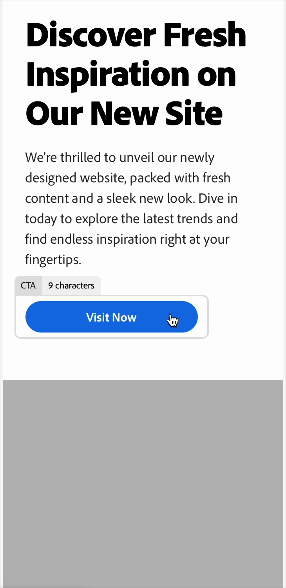

# Markdown 테스트 페이지

## 애니메이션 GIF의 표시 방법

### HTML 테이블에서

<table style="table-layout:fixed">
<tr style="border: 0;">
  <td valign="top">
    
이제 변형을 관리할 때 새 클릭 유도 문구(CTA)를 생성할 수 있습니다. 새 <em>구문 변경</em> 및 <em>링크 추가</em> 옵션을 사용하여 새 구문을 생성하고 CTA 링크를 편집합니다.

    
변형의 CTA 관리에 대한 지침은 <a href="/help/user-guide/create/manage-variants.md#revise-call-to-action">콜 투 액션 수정</a>을 참조하세요.

    
이러한 새로운 CTA 기능을 사용하려면 템플릿을 올바르게 설정해야 합니다. <em>템플릿 사용자 지정</em> 항목에서 <a href="/help/user-guide/content/customize-template.md#calls-to-action">작업 호출</a>의 지침을 따르십시오.

    <!-- GS-6676 -->
  </td>
  <td valign="top">
    </td>
  </tr>
</table>

### 일반 Markdown

이제 변형을 관리할 때 새 클릭 유도 문구(CTA)를 생성할 수 있습니다. 새 _구문 변경_ 및 _링크 추가_ 옵션을 사용하여 새 구문을 생성하고 CTA 링크를 편집합니다. 이러한 새로운 CTA 기능을 사용하려면 템플릿을 올바르게 설정해야 합니다. _템플릿 사용자 지정_&#x200B;의 지침을 따르십시오. [작업 호출](/help/user-guide/content/customize-template.md#calls-to-action). 변형의 CTA 관리에 대한 지침은 [콜 투 액션 수정](/help/user-guide/create/manage-variants.md#revise-call-to-action)을 참조하십시오. <!-- GS-6676 -->

{width="250" align="center" zoomable="yes"}
